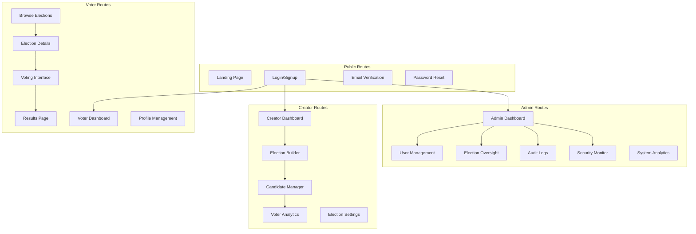
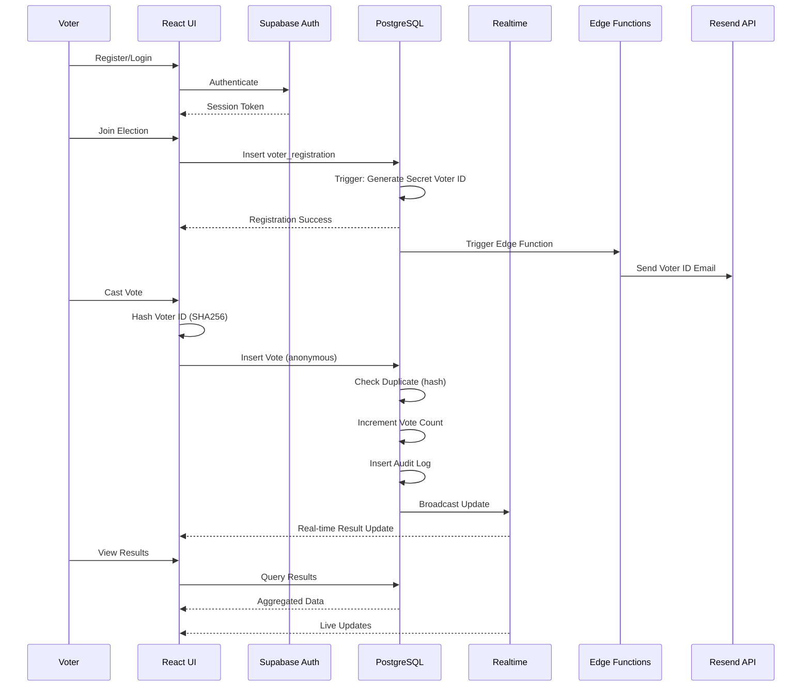

# Design Document: SecureVote Pro - Enterprise Election Management System

## Overview

SecureVote Pro is a comprehensive enterprise-level online election management system built with React 18, Supabase, and modern web technologies. The system provides a complete end-to-end solution for managing democratic elections with three distinct user roles: Voters, Election Creators, and Administrators. The platform emphasizes security through anonymous voting with SHA256-hashed voter IDs, real-time updates via Supabase Realtime, comprehensive audit logging, and role-based access control with Row-Level Security (RLS) policies.

The system architecture follows a modern serverless approach using Supabase as the backend-as-a-service platform, providing PostgreSQL database, authentication, real-time subscriptions, file storage, and edge functions. The frontend is built with React 18 using Vite for optimal performance, Tailwind CSS for styling, Framer Motion for animations, and a premium fintech-inspired black and gold theme. The application supports the complete election lifecycle from creation and candidate management through voter registration, anonymous voting, real-time result tracking, and comprehensive administrative oversight.

Key technical innovations include a cryptographically secure anonymous voting system that prevents duplicate votes while maintaining voter privacy, a real-time notification and update system leveraging Supabase's pub/sub capabilities, automated edge functions for email notifications and security monitoring, and a comprehensive audit trail system that logs all critical operations for compliance and security analysis.

## Architecture

### System Architecture Overview

```mermaid
graph TB
    subgraph "Client Layer"
        A[React 18 SPA]
        B[React Router v6]
        C[Framer Motion]
        D[Tailwind CSS]
    end
    
    subgraph "State Management"
        E[Redux Toolkit]
        F[React Context]
    end
    
    subgraph "Supabase Backend"
        G[PostgreSQL Database]
        H[Supabase Auth]
        I[Supabase Storage]
        J[Supabase Realtime]
        K[Edge Functions]
    end
    
    subgraph "External Services"
        L[Resend Email API]
        M[Crypto-JS]
    end
    
    A --> B
    A --> C
    A --> D
    A --> E
    A --> F
    E --> G
    E --> H
    E --> I
    E --> J
    K --> L
    A --> M
    K --> G
    
    style A fill:#1a1a1a,stroke:#d4af37,stroke-width:2px
    style G fill:#1a1a1a,stroke:#d4af37,stroke-width:2px
    style K fill:#1a1a1a,stroke:#d4af37,stroke-width:2px
```




### High-Level Component Architecture



### Data Flow Architecture




## Components and Interfaces

### Core Authentication Components

#### AuthProvider Component

**Purpose**: Manages global authentication state and provides auth context to the application

**Interface**:
```typescript
interface AuthContextType {
  user: User | null;
  session: Session | null;
  profile: UserProfile | null;
  loading: boolean;
  signUp: (email: string, password: string, userData: SignUpData) => Promise<AuthResult>;
  signIn: (email: string, password: string) => Promise<AuthResult>;
  signOut: () => Promise<void>;
  resetPassword: (email: string) => Promise<void>;
  updateProfile: (updates: Partial<UserProfile>) => Promise<void>;
  refreshSession: () => Promise<void>;
}

interface SignUpData {
  full_name: string;
  username: string;
  role?: 'voter' | 'creator' | 'admin';
}

interface AuthResult {
  success: boolean;
  error?: string;
  user?: User;
}
```

**Responsibilities**:
- Initialize Supabase auth listener on mount
- Manage user session state across app
- Handle authentication operations (signup, login, logout)
- Fetch and cache user profile data
- Provide auth state to child components via Context API
- Handle session refresh and token management

#### ProtectedRoute Component

**Purpose**: Route guard component that enforces authentication and role-based access control

**Interface**:
```typescript
interface ProtectedRouteProps {
  children: React.ReactNode;
  requiredRole?: 'voter' | 'creator' | 'admin';
  redirectTo?: string;
}

const ProtectedRoute: React.FC<ProtectedRouteProps>;
```

**Responsibilities**:
- Check authentication status before rendering
- Verify user role matches required role
- Redirect unauthenticated users to login
- Redirect unauthorized users to appropriate dashboard
- Show loading state during auth check

### Election Management Components

#### ElectionBuilder Component

**Purpose**: Multi-step form for creating and editing elections

**Interface**:
```typescript
interface ElectionBuilderProps {
  electionId?: string;
  mode: 'create' | 'edit';
  onComplete: (election: Election) => void;
}

interface ElectionFormData {
  title: string;
  description: string;
  category_id: string;
  start_date: Date;
  end_date: Date;
  max_voters: number;
  allow_waitlist: boolean;
  is_public: boolean;
  banner_url?: string;
  settings: ElectionSettings;
}

interface ElectionSettings {
  show_results_before_end: boolean;
  allow_vote_change: boolean;
  require_voter_approval: boolean;
  send_reminders: boolean;
}
```

**Responsibilities**:
- Manage multi-step form state (details, candidates, settings, review)
- Validate form data using Zod schemas
- Handle draft saving and auto-save functionality
- Upload and manage election banner images
- Submit election data to Supabase
- Handle edit mode with pre-populated data

#### CandidateManager Component

**Purpose**: CRUD interface for managing election candidates

**Interface**:
```typescript
interface CandidateManagerProps {
  electionId: string;
  editable: boolean;
}

interface Candidate {
  id: string;
  election_id: string;
  name: string;
  party?: string;
  manifesto?: string;
  photo_url?: string;
  display_order: number;
  created_at: Date;
}

interface CandidateFormData {
  name: string;
  party?: string;
  manifesto?: string;
  photo?: File;
}
```

**Responsibilities**:
- Display list of candidates with photos and details
- Add new candidates with photo upload
- Edit existing candidate information
- Delete candidates with confirmation
- Reorder candidates via drag-and-drop
- Upload candidate photos to Supabase Storage
- Validate candidate data before submission


### Voting System Components

#### VotingInterface Component

**Purpose**: Secure anonymous voting interface with duplicate prevention

**Interface**:
```typescript
interface VotingInterfaceProps {
  election: Election;
  candidates: Candidate[];
  voterRegistration: VoterRegistration;
  onVoteSubmit: (voteData: VoteSubmission) => Promise<VoteResult>;
}

interface VoterRegistration {
  id: string;
  election_id: string;
  voter_id: string;
  secret_voter_id: string;
  status: 'registered' | 'waitlist' | 'approved';
  registered_at: Date;
}

interface VoteSubmission {
  election_id: string;
  candidate_id: string;
  secret_voter_id: string;
  voter_id_hash: string;
}

interface VoteResult {
  success: boolean;
  error?: string;
  message: string;
}
```

**Responsibilities**:
- Display candidates with photos and manifestos
- Validate secret voter ID before allowing vote
- Hash voter ID using SHA256 before submission
- Submit anonymous vote to database
- Handle duplicate vote prevention errors
- Show confirmation after successful vote
- Prevent multiple submissions via UI state

#### ResultsDisplay Component

**Purpose**: Real-time election results visualization with charts and analytics

**Interface**:
```typescript
interface ResultsDisplayProps {
  election: Election;
  showLiveUpdates?: boolean;
}

interface ElectionResults {
  election_id: string;
  total_votes: number;
  total_registered: number;
  turnout_percentage: number;
  candidates: CandidateResult[];
  last_updated: Date;
}

interface CandidateResult {
  candidate_id: string;
  name: string;
  party?: string;
  photo_url?: string;
  vote_count: number;
  vote_percentage: number;
  rank: number;
}
```

**Responsibilities**:
- Fetch and display election results
- Subscribe to real-time result updates via Supabase Realtime
- Render vote distribution charts using Recharts
- Calculate and display turnout percentage
- Show candidate rankings and vote counts
- Animate result changes with Framer Motion
- Handle results visibility based on election settings

### Dashboard Components

#### VoterDashboard Component

**Purpose**: Main dashboard for voters showing elections, history, and notifications

**Interface**:
```typescript
interface VoterDashboardProps {
  userId: string;
}

interface DashboardData {
  activeElections: Election[];
  registeredElections: Election[];
  completedElections: Election[];
  notifications: Notification[];
  votingHistory: VotingHistoryItem[];
}

interface VotingHistoryItem {
  election_id: string;
  election_title: string;
  voted_at: Date;
  election_status: ElectionStatus;
}
```

**Responsibilities**:
- Display active elections available to join
- Show registered elections with voting status
- Display voting history and past elections
- Show real-time notifications
- Provide quick actions (join, vote, view results)
- Display election countdowns and deadlines

#### CreatorDashboard Component

**Purpose**: Dashboard for election creators with analytics and management tools

**Interface**:
```typescript
interface CreatorDashboardProps {
  userId: string;
}

interface CreatorDashboardData {
  draftElections: Election[];
  activeElections: Election[];
  completedElections: Election[];
  analytics: CreatorAnalytics;
}

interface CreatorAnalytics {
  total_elections: number;
  total_voters: number;
  active_elections: number;
  avg_turnout: number;
  recent_activity: ActivityItem[];
}
```

**Responsibilities**:
- Display all elections created by user
- Show election status and quick stats
- Provide quick actions (edit, publish, delete, view analytics)
- Display creator analytics and metrics
- Show recent voter registrations and votes
- Handle election state transitions


#### AdminDashboard Component

**Purpose**: Comprehensive administrative control panel with system oversight

**Interface**:
```typescript
interface AdminDashboardProps {
  userId: string;
}

interface AdminDashboardData {
  systemStats: SystemStats;
  recentUsers: UserProfile[];
  recentElections: Election[];
  pendingCreatorRequests: CreatorRequest[];
  securityAlerts: SecurityAlert[];
  auditLogs: AuditLog[];
}

interface SystemStats {
  total_users: number;
  total_elections: number;
  total_votes: number;
  active_elections: number;
  users_online: number;
  votes_today: number;
}

interface SecurityAlert {
  id: string;
  type: 'duplicate_vote_attempt' | 'suspicious_login' | 'mass_registration';
  severity: 'low' | 'medium' | 'high' | 'critical';
  description: string;
  user_id?: string;
  election_id?: string;
  created_at: Date;
}
```

**Responsibilities**:
- Display real-time system statistics
- Show pending creator access requests
- Display security alerts and suspicious activity
- Provide user management actions (suspend, delete)
- Show recent audit logs
- Provide election oversight (delete, cancel)
- Display live activity feed

### Notification System Components

#### NotificationCenter Component

**Purpose**: Real-time notification display and management

**Interface**:
```typescript
interface NotificationCenterProps {
  userId: string;
  maxDisplay?: number;
}

interface Notification {
  id: string;
  user_id: string;
  type: NotificationType;
  title: string;
  message: string;
  data?: Record<string, any>;
  read: boolean;
  created_at: Date;
}

type NotificationType = 
  | 'election_published'
  | 'election_starting'
  | 'election_ending'
  | 'vote_confirmed'
  | 'registration_approved'
  | 'creator_request_approved'
  | 'creator_request_rejected'
  | 'election_cancelled'
  | 'security_alert';
```

**Responsibilities**:
- Subscribe to real-time notifications via Supabase Realtime
- Display notifications with appropriate icons and styling
- Mark notifications as read
- Handle notification actions (view election, view details)
- Show unread count badge
- Auto-dismiss transient notifications

## Data Models

### User and Profile Models

#### profiles Table

```typescript
interface UserProfile {
  id: string; // UUID, references auth.users
  email: string;
  full_name: string;
  username: string;
  role: 'voter' | 'creator' | 'admin';
  avatar_url?: string;
  bio?: string;
  is_suspended: boolean;
  email_verified: boolean;
  created_at: Date;
  updated_at: Date;
}
```

**Validation Rules**:
- `email` must be valid email format and unique
- `username` must be 3-30 characters, alphanumeric with underscores, unique
- `full_name` must be 2-100 characters
- `role` defaults to 'voter'
- `is_suspended` defaults to false
- `email_verified` defaults to false

**Indexes**:
- Primary key on `id`
- Unique index on `email`
- Unique index on `username`
- Index on `role` for role-based queries
- Index on `is_suspended` for filtering active users

**RLS Policies**:
- Users can read their own profile
- Users can update their own profile (except role and is_suspended)
- Admins can read all profiles
- Admins can update any profile
- Public can read basic profile info (username, avatar_url) for display purposes


### Election Models

#### elections Table

```typescript
interface Election {
  id: string; // UUID
  creator_id: string; // UUID, references profiles(id)
  title: string;
  description: string;
  category_id: string; // UUID, references election_categories(id)
  status: ElectionStatus;
  start_date: Date;
  end_date: Date;
  max_voters: number;
  current_voters: number;
  total_votes: number;
  allow_waitlist: boolean;
  is_public: boolean;
  banner_url?: string;
  settings: ElectionSettings;
  voter_list_locked: boolean;
  created_at: Date;
  updated_at: Date;
}

type ElectionStatus = 'draft' | 'published' | 'active' | 'completed' | 'cancelled';

interface ElectionSettings {
  show_results_before_end: boolean;
  allow_vote_change: boolean;
  require_voter_approval: boolean;
  send_reminders: boolean;
}
```

**Validation Rules**:
- `title` must be 5-200 characters
- `description` must be 10-2000 characters
- `start_date` must be in the future (for new elections)
- `end_date` must be after `start_date`
- `max_voters` must be positive integer (1-1000000)
- `current_voters` defaults to 0
- `total_votes` defaults to 0
- `status` defaults to 'draft'
- `voter_list_locked` defaults to false

**Indexes**:
- Primary key on `id`
- Index on `creator_id` for creator queries
- Index on `status` for filtering elections
- Index on `category_id` for category filtering
- Composite index on `(status, start_date)` for active election queries
- Index on `is_public` for public election discovery

**RLS Policies**:
- Public can read published/active/completed elections where `is_public = true`
- Creators can read their own elections (all statuses)
- Creators can insert elections (with creator_id = auth.uid())
- Creators can update their own elections (with restrictions based on status)
- Creators can delete their own draft elections
- Admins can read, update, and delete any election
- Voters can read elections they are registered for

#### candidates Table

```typescript
interface Candidate {
  id: string; // UUID
  election_id: string; // UUID, references elections(id) ON DELETE CASCADE
  name: string;
  party?: string;
  manifesto?: string;
  photo_url?: string;
  display_order: number;
  vote_count: number;
  created_at: Date;
  updated_at: Date;
}
```

**Validation Rules**:
- `name` must be 2-100 characters
- `party` must be 2-100 characters if provided
- `manifesto` must be max 5000 characters
- `display_order` must be positive integer
- `vote_count` defaults to 0

**Indexes**:
- Primary key on `id`
- Index on `election_id` for election queries
- Composite index on `(election_id, display_order)` for ordered retrieval

**RLS Policies**:
- Public can read candidates for public elections
- Creators can read candidates for their elections
- Creators can insert/update/delete candidates for their own elections (when not locked)
- Voters can read candidates for elections they're registered for
- Admins can perform all operations

### Voting Models

#### voter_registrations Table

```typescript
interface VoterRegistration {
  id: string; // UUID
  election_id: string; // UUID, references elections(id) ON DELETE CASCADE
  voter_id: string; // UUID, references profiles(id) ON DELETE CASCADE
  secret_voter_id: string; // Generated unique identifier
  status: RegistrationStatus;
  registered_at: Date;
  approved_at?: Date;
  approved_by?: string; // UUID, references profiles(id)
}

type RegistrationStatus = 'registered' | 'waitlist' | 'approved' | 'rejected';
```

**Validation Rules**:
- Unique constraint on `(election_id, voter_id)` - one registration per voter per election
- `secret_voter_id` must be unique across all registrations
- `status` defaults to 'registered' (or 'waitlist' if election is full)

**Indexes**:
- Primary key on `id`
- Unique index on `secret_voter_id`
- Unique composite index on `(election_id, voter_id)`
- Index on `election_id` for election queries
- Index on `voter_id` for voter queries

**RLS Policies**:
- Voters can read their own registrations
- Voters can insert registrations (with voter_id = auth.uid())
- Creators can read registrations for their elections
- Creators can update registration status for their elections
- Admins can perform all operations


#### votes Table

```typescript
interface Vote {
  id: string; // UUID
  election_id: string; // UUID, references elections(id) ON DELETE CASCADE
  candidate_id: string; // UUID, references candidates(id) ON DELETE CASCADE
  voter_id_hash: string; // SHA256 hash of secret_voter_id
  voted_at: Date;
}
```

**Validation Rules**:
- Unique constraint on `(election_id, voter_id_hash)` - prevents duplicate votes
- `voter_id_hash` must be 64-character hex string (SHA256 output)
- No direct reference to voter identity - ensures anonymity

**Indexes**:
- Primary key on `id`
- Unique composite index on `(election_id, voter_id_hash)` for duplicate prevention
- Index on `election_id` for result aggregation
- Index on `candidate_id` for vote counting

**RLS Policies**:
- Voters can insert votes (anonymous - no voter_id check)
- Public can read vote counts (aggregated) for completed elections
- Creators can read aggregated vote data for their elections
- Admins can read all vote data
- No one can update or delete votes (immutable audit trail)

### Administrative Models

#### audit_logs Table

```typescript
interface AuditLog {
  id: string; // UUID
  user_id?: string; // UUID, references profiles(id)
  action: AuditAction;
  entity_type: EntityType;
  entity_id?: string;
  details: Record<string, any>;
  ip_address?: string;
  user_agent?: string;
  created_at: Date;
}

type AuditAction = 
  | 'user_created' | 'user_updated' | 'user_suspended' | 'user_deleted'
  | 'election_created' | 'election_updated' | 'election_published' | 'election_deleted' | 'election_cancelled'
  | 'candidate_created' | 'candidate_updated' | 'candidate_deleted'
  | 'voter_registered' | 'voter_approved' | 'voter_rejected'
  | 'vote_cast' | 'vote_duplicate_attempt'
  | 'creator_request_submitted' | 'creator_request_approved' | 'creator_request_rejected'
  | 'login_success' | 'login_failed' | 'logout'
  | 'password_reset_requested' | 'password_reset_completed';

type EntityType = 'user' | 'election' | 'candidate' | 'vote' | 'registration' | 'creator_request';
```

**Validation Rules**:
- `action` must be one of the defined audit actions
- `entity_type` must be one of the defined entity types
- `details` stored as JSONB for flexible data structure

**Indexes**:
- Primary key on `id`
- Index on `user_id` for user activity queries
- Index on `action` for action-based filtering
- Index on `entity_type` for entity-based filtering
- Index on `created_at` for time-based queries
- Composite index on `(entity_type, entity_id)` for entity history

**RLS Policies**:
- System can insert audit logs (via triggers and edge functions)
- Admins can read all audit logs
- Users can read their own audit logs
- No one can update or delete audit logs (immutable)

#### election_creator_requests Table

```typescript
interface CreatorRequest {
  id: string; // UUID
  user_id: string; // UUID, references profiles(id) ON DELETE CASCADE
  reason: string;
  status: RequestStatus;
  reviewed_by?: string; // UUID, references profiles(id)
  reviewed_at?: Date;
  rejection_reason?: string;
  created_at: Date;
}

type RequestStatus = 'pending' | 'approved' | 'rejected';
```

**Validation Rules**:
- `reason` must be 20-1000 characters
- `status` defaults to 'pending'
- Unique constraint on `user_id` where `status = 'pending'` (one pending request per user)

**Indexes**:
- Primary key on `id`
- Index on `user_id` for user queries
- Index on `status` for filtering pending requests
- Index on `reviewed_by` for admin activity tracking

**RLS Policies**:
- Users can insert their own creator requests
- Users can read their own requests
- Admins can read all requests
- Admins can update request status and add rejection reasons


#### notifications Table

```typescript
interface Notification {
  id: string; // UUID
  user_id: string; // UUID, references profiles(id) ON DELETE CASCADE
  type: NotificationType;
  title: string;
  message: string;
  data?: Record<string, any>;
  read: boolean;
  created_at: Date;
}

type NotificationType = 
  | 'election_published'
  | 'election_starting'
  | 'election_ending'
  | 'vote_confirmed'
  | 'registration_approved'
  | 'registration_rejected'
  | 'creator_request_approved'
  | 'creator_request_rejected'
  | 'election_cancelled'
  | 'security_alert'
  | 'system_announcement';
```

**Validation Rules**:
- `title` must be 1-200 characters
- `message` must be 1-1000 characters
- `read` defaults to false
- `data` stored as JSONB for flexible notification metadata

**Indexes**:
- Primary key on `id`
- Index on `user_id` for user notifications
- Index on `read` for filtering unread notifications
- Composite index on `(user_id, read, created_at)` for efficient queries

**RLS Policies**:
- Users can read their own notifications
- Users can update their own notifications (mark as read)
- System can insert notifications (via edge functions)
- Admins can insert notifications for any user

#### security_logs Table

```typescript
interface SecurityLog {
  id: string; // UUID
  event_type: SecurityEventType;
  severity: 'low' | 'medium' | 'high' | 'critical';
  user_id?: string; // UUID, references profiles(id)
  election_id?: string; // UUID, references elections(id)
  description: string;
  metadata: Record<string, any>;
  ip_address?: string;
  user_agent?: string;
  created_at: Date;
}

type SecurityEventType = 
  | 'duplicate_vote_attempt'
  | 'invalid_voter_id'
  | 'suspicious_login'
  | 'mass_registration'
  | 'rapid_voting'
  | 'unauthorized_access_attempt'
  | 'data_breach_attempt'
  | 'sql_injection_attempt';
```

**Validation Rules**:
- `event_type` must be one of the defined security event types
- `severity` must be one of: low, medium, high, critical
- `description` must be 1-1000 characters
- `metadata` stored as JSONB for flexible event data

**Indexes**:
- Primary key on `id`
- Index on `event_type` for event filtering
- Index on `severity` for severity-based queries
- Index on `user_id` for user-specific security events
- Index on `created_at` for time-based analysis

**RLS Policies**:
- System can insert security logs (via triggers and edge functions)
- Admins can read all security logs
- No one can update or delete security logs (immutable)

### Supporting Models

#### election_categories Table

```typescript
interface ElectionCategory {
  id: string; // UUID
  name: string;
  description?: string;
  icon?: string;
  display_order: number;
  created_at: Date;
}
```

**Validation Rules**:
- `name` must be 2-50 characters and unique
- `display_order` must be positive integer

**Indexes**:
- Primary key on `id`
- Unique index on `name`
- Index on `display_order` for ordered retrieval

#### user_settings Table

```typescript
interface UserSettings {
  id: string; // UUID
  user_id: string; // UUID, references profiles(id) ON DELETE CASCADE, UNIQUE
  email_notifications: boolean;
  push_notifications: boolean;
  election_reminders: boolean;
  result_notifications: boolean;
  theme: 'light' | 'dark' | 'auto';
  language: string;
  timezone: string;
  created_at: Date;
  updated_at: Date;
}
```

**Validation Rules**:
- Unique constraint on `user_id` (one settings record per user)
- All notification flags default to true
- `theme` defaults to 'dark'
- `language` defaults to 'en'
- `timezone` defaults to 'UTC'

**Indexes**:
- Primary key on `id`
- Unique index on `user_id`


## Algorithmic Pseudocode

### Authentication Algorithms

#### User Registration Algorithm

```typescript
async function registerUser(
  email: string,
  password: string,
  userData: SignUpData
): Promise<AuthResult> {
  // INPUT: email, password, userData (full_name, username, role)
  // OUTPUT: AuthResult with success status and user data
  // PRECONDITIONS:
  //   - email is valid email format
  //   - password is at least 8 characters
  //   - username is 3-30 characters, alphanumeric
  //   - full_name is 2-100 characters
  // POSTCONDITIONS:
  //   - If successful: user created in auth.users and profiles table
  //   - If successful: email verification sent
  //   - If failed: appropriate error message returned
  
  try {
    // Step 1: Validate input data
    const validationResult = validateSignUpData(email, password, userData);
    if (!validationResult.valid) {
      return { success: false, error: validationResult.error };
    }
    
    // Step 2: Check if email already exists
    const existingUser = await supabase
      .from('profiles')
      .select('email')
      .eq('email', email)
      .single();
    
    if (existingUser.data) {
      return { success: false, error: 'Email already registered' };
    }
    
    // Step 3: Check if username already exists
    const existingUsername = await supabase
      .from('profiles')
      .select('username')
      .eq('username', userData.username)
      .single();
    
    if (existingUsername.data) {
      return { success: false, error: 'Username already taken' };
    }
    
    // Step 4: Create auth user
    const { data: authData, error: authError } = await supabase.auth.signUp({
      email,
      password,
      options: {
        data: {
          full_name: userData.full_name,
          username: userData.username,
          role: userData.role || 'voter'
        }
      }
    });
    
    if (authError) {
      return { success: false, error: authError.message };
    }
    
    // Step 5: Profile is automatically created via database trigger
    // Trigger: on_auth_user_created
    
    // Step 6: Send verification email (handled by Supabase)
    
    // Step 7: Create default user settings
    await supabase.from('user_settings').insert({
      user_id: authData.user!.id,
      email_notifications: true,
      push_notifications: true,
      election_reminders: true,
      result_notifications: true,
      theme: 'dark',
      language: 'en',
      timezone: 'UTC'
    });
    
    // Step 8: Log audit event
    await insertAuditLog({
      user_id: authData.user!.id,
      action: 'user_created',
      entity_type: 'user',
      entity_id: authData.user!.id,
      details: { email, username: userData.username, role: userData.role }
    });
    
    return { success: true, user: authData.user };
    
  } catch (error) {
    return { success: false, error: 'Registration failed. Please try again.' };
  }
}
```

**Preconditions**:
- `email` is non-empty and valid email format
- `password` is at least 8 characters with complexity requirements
- `userData.username` is 3-30 characters, alphanumeric with underscores
- `userData.full_name` is 2-100 characters

**Postconditions**:
- If successful: User record created in `auth.users` table
- If successful: Profile record created in `profiles` table via trigger
- If successful: User settings record created in `user_settings` table
- If successful: Audit log entry created
- If successful: Verification email sent to user
- If failed: No database changes persisted (transaction rollback)
- Returns `AuthResult` with success status and error message if applicable

**Loop Invariants**: N/A (no loops in this algorithm)


#### User Login Algorithm

```typescript
async function loginUser(
  email: string,
  password: string
): Promise<AuthResult> {
  // INPUT: email, password
  // OUTPUT: AuthResult with success status, user data, and session
  // PRECONDITIONS:
  //   - email is valid email format
  //   - password is non-empty
  // POSTCONDITIONS:
  //   - If successful: session created and returned
  //   - If successful: user profile data fetched
  //   - If failed: appropriate error message returned
  //   - Audit log entry created for login attempt
  
  try {
    // Step 1: Validate input
    if (!email || !password) {
      return { success: false, error: 'Email and password are required' };
    }
    
    // Step 2: Attempt authentication
    const { data: authData, error: authError } = await supabase.auth.signInWithPassword({
      email,
      password
    });
    
    if (authError) {
      // Log failed login attempt
      await insertAuditLog({
        action: 'login_failed',
        entity_type: 'user',
        details: { email, reason: authError.message }
      });
      
      return { success: false, error: 'Invalid email or password' };
    }
    
    // Step 3: Check if user is suspended
    const { data: profile } = await supabase
      .from('profiles')
      .select('is_suspended, role')
      .eq('id', authData.user.id)
      .single();
    
    if (profile?.is_suspended) {
      await supabase.auth.signOut();
      return { success: false, error: 'Account suspended. Contact administrator.' };
    }
    
    // Step 4: Log successful login
    await insertAuditLog({
      user_id: authData.user.id,
      action: 'login_success',
      entity_type: 'user',
      entity_id: authData.user.id,
      details: { email }
    });
    
    return { success: true, user: authData.user };
    
  } catch (error) {
    return { success: false, error: 'Login failed. Please try again.' };
  }
}
```

**Preconditions**:
- `email` is non-empty string
- `password` is non-empty string

**Postconditions**:
- If successful: Valid session token created and stored
- If successful: User object returned with profile data
- If successful: Audit log entry created with action 'login_success'
- If failed: No session created
- If failed: Audit log entry created with action 'login_failed'
- If user suspended: Session immediately terminated
- Returns `AuthResult` with success status

**Loop Invariants**: N/A (no loops in this algorithm)

### Election Management Algorithms

#### Create Election Algorithm

```typescript
async function createElection(
  creatorId: string,
  electionData: ElectionFormData
): Promise<{ success: boolean; election?: Election; error?: string }> {
  // INPUT: creatorId, electionData
  // OUTPUT: Result object with success status and election data
  // PRECONDITIONS:
  //   - creatorId is valid user with 'creator' or 'admin' role
  //   - electionData passes validation schema
  //   - start_date is in the future
  //   - end_date is after start_date
  // POSTCONDITIONS:
  //   - If successful: election record created with status 'draft'
  //   - If successful: audit log entry created
  //   - If banner uploaded: banner stored in Supabase Storage
  //   - Returns election object with generated ID
  
  try {
    // Step 1: Validate creator role
    const { data: profile } = await supabase
      .from('profiles')
      .select('role')
      .eq('id', creatorId)
      .single();
    
    if (!profile || !['creator', 'admin'].includes(profile.role)) {
      return { success: false, error: 'Unauthorized. Creator access required.' };
    }
    
    // Step 2: Validate election data
    const validationResult = validateElectionData(electionData);
    if (!validationResult.valid) {
      return { success: false, error: validationResult.error };
    }
    
    // Step 3: Validate dates
    const now = new Date();
    const startDate = new Date(electionData.start_date);
    const endDate = new Date(electionData.end_date);
    
    if (startDate <= now) {
      return { success: false, error: 'Start date must be in the future' };
    }
    
    if (endDate <= startDate) {
      return { success: false, error: 'End date must be after start date' };
    }
    
    // Step 4: Upload banner if provided
    let bannerUrl = null;
    if (electionData.banner_file) {
      const uploadResult = await uploadElectionBanner(
        electionData.banner_file,
        creatorId
      );
      if (uploadResult.success) {
        bannerUrl = uploadResult.url;
      }
    }
    
    // Step 5: Insert election record
    const { data: election, error: insertError } = await supabase
      .from('elections')
      .insert({
        creator_id: creatorId,
        title: electionData.title,
        description: electionData.description,
        category_id: electionData.category_id,
        start_date: startDate.toISOString(),
        end_date: endDate.toISOString(),
        max_voters: electionData.max_voters,
        allow_waitlist: electionData.allow_waitlist,
        is_public: electionData.is_public,
        banner_url: bannerUrl,
        settings: electionData.settings,
        status: 'draft',
        current_voters: 0,
        total_votes: 0,
        voter_list_locked: false
      })
      .select()
      .single();
    
    if (insertError) {
      return { success: false, error: 'Failed to create election' };
    }
    
    // Step 6: Log audit event
    await insertAuditLog({
      user_id: creatorId,
      action: 'election_created',
      entity_type: 'election',
      entity_id: election.id,
      details: { title: election.title, status: 'draft' }
    });
    
    return { success: true, election };
    
  } catch (error) {
    return { success: false, error: 'Election creation failed' };
  }
}
```

**Preconditions**:
- `creatorId` is valid UUID of user with role 'creator' or 'admin'
- `electionData.title` is 5-200 characters
- `electionData.description` is 10-2000 characters
- `electionData.start_date` is valid date in the future
- `electionData.end_date` is valid date after start_date
- `electionData.max_voters` is positive integer between 1 and 1000000

**Postconditions**:
- If successful: Election record created in `elections` table with status 'draft'
- If successful: `election.id` is generated UUID
- If successful: `election.current_voters` initialized to 0
- If successful: `election.total_votes` initialized to 0
- If successful: Audit log entry created
- If banner provided: Banner image uploaded to Supabase Storage bucket 'election-banners'
- If failed: No database changes persisted
- Returns result object with success status and election data or error message

**Loop Invariants**: N/A (no loops in this algorithm)


### Voting System Algorithms

#### Voter Registration Algorithm

```typescript
async function registerForElection(
  voterId: string,
  electionId: string
): Promise<{ success: boolean; registration?: VoterRegistration; error?: string }> {
  // INPUT: voterId, electionId
  // OUTPUT: Result object with success status and registration data
  // PRECONDITIONS:
  //   - voterId is valid user with 'voter' role
  //   - electionId is valid published election
  //   - voter is not already registered for this election
  // POSTCONDITIONS:
  //   - If successful: registration record created
  //   - If successful: secret_voter_id generated and stored
  //   - If successful: current_voters count incremented (if not waitlist)
  //   - If successful: email sent with secret voter ID
  //   - If election full: registration added to waitlist
  
  try {
    // Step 1: Validate voter role
    const { data: profile } = await supabase
      .from('profiles')
      .select('role, is_suspended')
      .eq('id', voterId)
      .single();
    
    if (!profile || profile.is_suspended) {
      return { success: false, error: 'Account suspended or invalid' };
    }
    
    // Step 2: Fetch election details
    const { data: election } = await supabase
      .from('elections')
      .select('*')
      .eq('id', electionId)
      .single();
    
    if (!election) {
      return { success: false, error: 'Election not found' };
    }
    
    if (election.status !== 'published' && election.status !== 'active') {
      return { success: false, error: 'Election not available for registration' };
    }
    
    if (election.voter_list_locked) {
      return { success: false, error: 'Voter registration is closed' };
    }
    
    // Step 3: Check if already registered
    const { data: existingReg } = await supabase
      .from('voter_registrations')
      .select('id')
      .eq('election_id', electionId)
      .eq('voter_id', voterId)
      .single();
    
    if (existingReg) {
      return { success: false, error: 'Already registered for this election' };
    }
    
    // Step 4: Determine registration status
    let status: RegistrationStatus = 'registered';
    if (election.current_voters >= election.max_voters) {
      if (election.allow_waitlist) {
        status = 'waitlist';
      } else {
        return { success: false, error: 'Election is full' };
      }
    }
    
    // Step 5: Generate secret voter ID
    const secretVoterId = generateSecretVoterId();
    
    // Step 6: Insert registration record
    const { data: registration, error: insertError } = await supabase
      .from('voter_registrations')
      .insert({
        election_id: electionId,
        voter_id: voterId,
        secret_voter_id: secretVoterId,
        status: status
      })
      .select()
      .single();
    
    if (insertError) {
      return { success: false, error: 'Registration failed' };
    }
    
    // Step 7: Increment current_voters if not waitlist
    // This is handled by database trigger: on_voter_registration_created
    
    // Step 8: Send email with secret voter ID
    // This is handled by edge function: send-voter-id-email
    
    // Step 9: Create notification
    await supabase.from('notifications').insert({
      user_id: voterId,
      type: status === 'waitlist' ? 'registration_waitlist' : 'registration_approved',
      title: status === 'waitlist' ? 'Added to Waitlist' : 'Registration Successful',
      message: status === 'waitlist' 
        ? `You've been added to the waitlist for "${election.title}"`
        : `You're registered for "${election.title}". Check your email for your secret voter ID.`,
      data: { election_id: electionId }
    });
    
    // Step 10: Log audit event
    await insertAuditLog({
      user_id: voterId,
      action: 'voter_registered',
      entity_type: 'registration',
      entity_id: registration.id,
      details: { election_id: electionId, status }
    });
    
    return { success: true, registration };
    
  } catch (error) {
    return { success: false, error: 'Registration failed' };
  }
}

function generateSecretVoterId(): string {
  // Generate cryptographically secure random voter ID
  // Format: VOTE-XXXX-XXXX-XXXX (16 alphanumeric characters)
  const chars = 'ABCDEFGHIJKLMNOPQRSTUVWXYZ0123456789';
  const segments = 4;
  const segmentLength = 4;
  
  let voterId = 'VOTE';
  for (let i = 0; i < segments; i++) {
    voterId += '-';
    for (let j = 0; j < segmentLength; j++) {
      const randomIndex = Math.floor(Math.random() * chars.length);
      voterId += chars[randomIndex];
    }
  }
  
  return voterId;
}
```

**Preconditions**:
- `voterId` is valid UUID of user with role 'voter'
- `electionId` is valid UUID of existing election
- Election status is 'published' or 'active'
- Voter is not suspended (`is_suspended = false`)
- Voter is not already registered for this election
- Election voter list is not locked (`voter_list_locked = false`)

**Postconditions**:
- If successful and election not full: Registration created with status 'registered'
- If successful and election full with waitlist: Registration created with status 'waitlist'
- If successful and status 'registered': `election.current_voters` incremented by 1 (via trigger)
- If successful: Unique `secret_voter_id` generated and stored
- If successful: Email sent to voter with secret voter ID (via edge function)
- If successful: Notification created for voter
- If successful: Audit log entry created
- If election full and no waitlist: No registration created, error returned
- If already registered: No changes made, error returned
- Returns result object with success status and registration data or error message

**Loop Invariants**:
- In `generateSecretVoterId`: Each iteration adds one random character from valid charset
- After loop completion: voterId has format "VOTE-XXXX-XXXX-XXXX-XXXX" with 16 random chars


#### Anonymous Vote Casting Algorithm

```typescript
async function castVote(
  electionId: string,
  candidateId: string,
  secretVoterId: string
): Promise<VoteResult> {
  // INPUT: electionId, candidateId, secretVoterId
  // OUTPUT: VoteResult with success status and message
  // PRECONDITIONS:
  //   - electionId is valid active election
  //   - candidateId is valid candidate in the election
  //   - secretVoterId is valid secret voter ID for this election
  //   - voter has not already voted (checked via hash)
  // POSTCONDITIONS:
  //   - If successful: anonymous vote record created
  //   - If successful: candidate vote_count incremented
  //   - If successful: election total_votes incremented
  //   - If successful: audit log entry created (without voter identity)
  //   - If duplicate: security log entry created
  //   - Vote is completely anonymous (no link to voter identity)
  
  try {
    // Step 1: Validate election status
    const { data: election } = await supabase
      .from('elections')
      .select('id, status, start_date, end_date')
      .eq('id', electionId)
      .single();
    
    if (!election) {
      return { success: false, error: 'Election not found', message: '' };
    }
    
    if (election.status !== 'active') {
      return { success: false, error: 'Election is not active', message: '' };
    }
    
    const now = new Date();
    const startDate = new Date(election.start_date);
    const endDate = new Date(election.end_date);
    
    if (now < startDate || now > endDate) {
      return { success: false, error: 'Election is not currently accepting votes', message: '' };
    }
    
    // Step 2: Validate candidate belongs to election
    const { data: candidate } = await supabase
      .from('candidates')
      .select('id')
      .eq('id', candidateId)
      .eq('election_id', electionId)
      .single();
    
    if (!candidate) {
      return { success: false, error: 'Invalid candidate', message: '' };
    }
    
    // Step 3: Verify secret voter ID is valid for this election
    const { data: registration } = await supabase
      .from('voter_registrations')
      .select('id, voter_id')
      .eq('election_id', electionId)
      .eq('secret_voter_id', secretVoterId)
      .eq('status', 'registered')
      .single();
    
    if (!registration) {
      return { 
        success: false, 
        error: 'Invalid voter ID or not registered', 
        message: '' 
      };
    }
    
    // Step 4: Hash the secret voter ID for anonymity
    const voterIdHash = hashVoterId(secretVoterId);
    
    // Step 5: Check for duplicate vote using hash
    const { data: existingVote } = await supabase
      .from('votes')
      .select('id')
      .eq('election_id', electionId)
      .eq('voter_id_hash', voterIdHash)
      .single();
    
    if (existingVote) {
      // Log security event for duplicate vote attempt
      await supabase.from('security_logs').insert({
        event_type: 'duplicate_vote_attempt',
        severity: 'medium',
        election_id: electionId,
        description: 'Duplicate vote attempt detected',
        metadata: { voter_id_hash: voterIdHash }
      });
      
      return { 
        success: false, 
        error: 'You have already voted in this election', 
        message: '' 
      };
    }
    
    // Step 6: Insert anonymous vote record
    const { data: vote, error: voteError } = await supabase
      .from('votes')
      .insert({
        election_id: electionId,
        candidate_id: candidateId,
        voter_id_hash: voterIdHash
      })
      .select()
      .single();
    
    if (voteError) {
      return { success: false, error: 'Failed to cast vote', message: '' };
    }
    
    // Step 7: Increment candidate vote count
    // This is handled by database trigger: on_vote_cast
    
    // Step 8: Increment election total votes
    // This is handled by database trigger: on_vote_cast
    
    // Step 9: Create notification for voter (using registration.voter_id)
    await supabase.from('notifications').insert({
      user_id: registration.voter_id,
      type: 'vote_confirmed',
      title: 'Vote Confirmed',
      message: 'Your vote has been successfully recorded',
      data: { election_id: electionId }
    });
    
    // Step 10: Log audit event (without voter identity)
    await insertAuditLog({
      action: 'vote_cast',
      entity_type: 'vote',
      entity_id: vote.id,
      details: { 
        election_id: electionId, 
        candidate_id: candidateId,
        // Note: voter identity NOT logged for anonymity
      }
    });
    
    return { 
      success: true, 
      message: 'Vote cast successfully! Your vote has been recorded anonymously.' 
    };
    
  } catch (error) {
    return { success: false, error: 'Vote casting failed', message: '' };
  }
}

function hashVoterId(secretVoterId: string): string {
  // Use SHA256 to hash the secret voter ID
  // This ensures anonymity while preventing duplicate votes
  const CryptoJS = require('crypto-js');
  return CryptoJS.SHA256(secretVoterId).toString();
}
```

**Preconditions**:
- `electionId` is valid UUID of existing election
- `candidateId` is valid UUID of candidate belonging to the election
- `secretVoterId` is valid secret voter ID string
- Election status is 'active'
- Current time is between election start_date and end_date
- Secret voter ID corresponds to a registered voter for this election
- Voter has not already voted (no existing vote with same voter_id_hash)

**Postconditions**:
- If successful: Vote record created in `votes` table with hashed voter ID
- If successful: `candidate.vote_count` incremented by 1 (via trigger)
- If successful: `election.total_votes` incremented by 1 (via trigger)
- If successful: Notification created for voter confirming vote
- If successful: Audit log entry created (without voter identity for anonymity)
- If successful: Real-time update broadcast to all subscribers
- If duplicate vote attempt: Security log entry created with severity 'medium'
- If duplicate vote attempt: No vote record created
- Vote is completely anonymous - no direct link to voter identity in votes table
- Only the hashed voter ID is stored, making it impossible to identify the voter
- Returns `VoteResult` with success status and user-friendly message

**Loop Invariants**: N/A (no loops in this algorithm)

**Security Properties**:
- Voter anonymity: Vote record contains only hashed voter ID, not actual voter identity
- Duplicate prevention: Hash uniqueness constraint prevents same voter from voting twice
- Auditability: All vote events logged without compromising voter anonymity
- Integrity: Cryptographic hash (SHA256) ensures voter ID cannot be reverse-engineered


### Real-Time Result Calculation Algorithm

```typescript
async function calculateElectionResults(
  electionId: string
): Promise<ElectionResults> {
  // INPUT: electionId
  // OUTPUT: ElectionResults with aggregated vote data
  // PRECONDITIONS:
  //   - electionId is valid election
  // POSTCONDITIONS:
  //   - Returns aggregated results with candidate rankings
  //   - Results include vote counts, percentages, and turnout
  //   - Results are calculated from current database state
  
  try {
    // Step 1: Fetch election details
    const { data: election } = await supabase
      .from('elections')
      .select('id, total_votes, current_voters')
      .eq('id', electionId)
      .single();
    
    if (!election) {
      throw new Error('Election not found');
    }
    
    // Step 2: Fetch all candidates with vote counts
    const { data: candidates } = await supabase
      .from('candidates')
      .select('id, name, party, photo_url, vote_count')
      .eq('election_id', electionId)
      .order('vote_count', { ascending: false });
    
    if (!candidates) {
      throw new Error('Failed to fetch candidates');
    }
    
    // Step 3: Calculate percentages and rankings
    const totalVotes = election.total_votes;
    const candidateResults: CandidateResult[] = [];
    
    for (let i = 0; i < candidates.length; i++) {
      const candidate = candidates[i];
      const votePercentage = totalVotes > 0 
        ? (candidate.vote_count / totalVotes) * 100 
        : 0;
      
      candidateResults.push({
        candidate_id: candidate.id,
        name: candidate.name,
        party: candidate.party,
        photo_url: candidate.photo_url,
        vote_count: candidate.vote_count,
        vote_percentage: Math.round(votePercentage * 100) / 100, // Round to 2 decimals
        rank: i + 1
      });
    }
    
    // Step 4: Calculate turnout percentage
    const turnoutPercentage = election.current_voters > 0
      ? (totalVotes / election.current_voters) * 100
      : 0;
    
    // Step 5: Return aggregated results
    return {
      election_id: electionId,
      total_votes: totalVotes,
      total_registered: election.current_voters,
      turnout_percentage: Math.round(turnoutPercentage * 100) / 100,
      candidates: candidateResults,
      last_updated: new Date()
    };
    
  } catch (error) {
    throw new Error('Failed to calculate results');
  }
}
```

**Preconditions**:
- `electionId` is valid UUID of existing election

**Postconditions**:
- Returns `ElectionResults` object with complete aggregated data
- `candidates` array sorted by vote_count in descending order
- Each candidate has calculated `vote_percentage` (0-100, rounded to 2 decimals)
- Each candidate has assigned `rank` (1-based, ordered by vote count)
- `turnout_percentage` calculated as (total_votes / total_registered) * 100
- If no votes cast: all percentages are 0
- `last_updated` timestamp reflects current time

**Loop Invariants**:
- For each iteration i in candidates loop:
  - All previously processed candidates (0 to i-1) have valid vote_percentage calculated
  - All previously processed candidates have rank assigned (1 to i)
  - candidateResults array contains exactly i elements after iteration i

### Election State Management Algorithm

```typescript
async function updateElectionStatus(): Promise<void> {
  // INPUT: None (runs as scheduled job)
  // OUTPUT: None (updates election statuses in database)
  // PRECONDITIONS:
  //   - Database connection is available
  // POSTCONDITIONS:
  //   - Elections past start_date changed from 'published' to 'active'
  //   - Elections past end_date changed from 'active' to 'completed'
  //   - Notifications sent for status changes
  //   - Audit logs created for status changes
  
  try {
    const now = new Date();
    
    // Step 1: Activate published elections that have reached start_date
    const { data: electionsToActivate } = await supabase
      .from('elections')
      .select('id, title, creator_id')
      .eq('status', 'published')
      .lte('start_date', now.toISOString());
    
    if (electionsToActivate && electionsToActivate.length > 0) {
      for (const election of electionsToActivate) {
        // Update status to active
        await supabase
          .from('elections')
          .update({ status: 'active' })
          .eq('id', election.id);
        
        // Notify creator
        await supabase.from('notifications').insert({
          user_id: election.creator_id,
          type: 'election_starting',
          title: 'Election Started',
          message: `Your election "${election.title}" is now active`,
          data: { election_id: election.id }
        });
        
        // Notify all registered voters
        const { data: registrations } = await supabase
          .from('voter_registrations')
          .select('voter_id')
          .eq('election_id', election.id)
          .eq('status', 'registered');
        
        if (registrations) {
          for (const reg of registrations) {
            await supabase.from('notifications').insert({
              user_id: reg.voter_id,
              type: 'election_starting',
              title: 'Election Now Active',
              message: `"${election.title}" is now accepting votes`,
              data: { election_id: election.id }
            });
          }
        }
        
        // Log audit event
        await insertAuditLog({
          action: 'election_status_changed',
          entity_type: 'election',
          entity_id: election.id,
          details: { from: 'published', to: 'active' }
        });
      }
    }
    
    // Step 2: Complete active elections that have reached end_date
    const { data: electionsToComplete } = await supabase
      .from('elections')
      .select('id, title, creator_id')
      .eq('status', 'active')
      .lte('end_date', now.toISOString());
    
    if (electionsToComplete && electionsToComplete.length > 0) {
      for (const election of electionsToComplete) {
        // Update status to completed
        await supabase
          .from('elections')
          .update({ status: 'completed' })
          .eq('id', election.id);
        
        // Notify creator
        await supabase.from('notifications').insert({
          user_id: election.creator_id,
          type: 'election_ending',
          title: 'Election Completed',
          message: `Your election "${election.title}" has ended. View results now.`,
          data: { election_id: election.id }
        });
        
        // Notify all registered voters
        const { data: registrations } = await supabase
          .from('voter_registrations')
          .select('voter_id')
          .eq('election_id', election.id)
          .eq('status', 'registered');
        
        if (registrations) {
          for (const reg of registrations) {
            await supabase.from('notifications').insert({
              user_id: reg.voter_id,
              type: 'election_ending',
              title: 'Election Completed',
              message: `"${election.title}" has ended. View final results.`,
              data: { election_id: election.id }
            });
          }
        }
        
        // Log audit event
        await insertAuditLog({
          action: 'election_status_changed',
          entity_type: 'election',
          entity_id: election.id,
          details: { from: 'active', to: 'completed' }
        });
      }
    }
    
  } catch (error) {
    console.error('Failed to update election statuses:', error);
  }
}
```

**Preconditions**:
- Database connection is available and functional
- Current timestamp can be determined

**Postconditions**:
- All elections with status 'published' and start_date <= now are updated to 'active'
- All elections with status 'active' and end_date <= now are updated to 'completed'
- For each status change: Creator receives notification
- For each status change: All registered voters receive notification
- For each status change: Audit log entry created
- If no elections need status update: No changes made
- Function completes without throwing errors (errors logged but not propagated)

**Loop Invariants**:
- In electionsToActivate loop: All previously processed elections have status 'active'
- In electionsToComplete loop: All previously processed elections have status 'completed'
- For each election processed: Exactly one notification sent to creator
- For each election processed: One notification sent to each registered voter


## Key Functions with Formal Specifications

### Database Trigger Functions

#### on_auth_user_created Trigger

```typescript
// Trigger: AFTER INSERT ON auth.users
// Purpose: Automatically create profile record when user signs up

function on_auth_user_created(): void {
  // Executed automatically after user creation in auth.users table
  // Creates corresponding profile record with user metadata
}
```

**Preconditions**:
- New user record inserted into `auth.users` table
- User metadata contains `full_name`, `username`, and `role`

**Postconditions**:
- Profile record created in `profiles` table with `id` matching `auth.users.id`
- Profile populated with email, full_name, username, and role from auth metadata
- `email_verified` set to false initially
- `is_suspended` set to false
- `created_at` and `updated_at` set to current timestamp

**Loop Invariants**: N/A (trigger function, no loops)

#### on_voter_registration_created Trigger

```typescript
// Trigger: AFTER INSERT ON voter_registrations
// Purpose: Increment election current_voters count when voter registers

function on_voter_registration_created(): void {
  // Executed automatically after voter registration
  // Increments current_voters if status is 'registered'
}
```

**Preconditions**:
- New registration record inserted into `voter_registrations` table
- Registration has valid `election_id`

**Postconditions**:
- If registration status is 'registered': `elections.current_voters` incremented by 1
- If registration status is 'waitlist': No change to current_voters
- Edge function triggered to send voter ID email

**Loop Invariants**: N/A (trigger function, no loops)

#### on_vote_cast Trigger

```typescript
// Trigger: AFTER INSERT ON votes
// Purpose: Increment vote counts when vote is cast

function on_vote_cast(): void {
  // Executed automatically after vote insertion
  // Updates candidate and election vote counts
}
```

**Preconditions**:
- New vote record inserted into `votes` table
- Vote has valid `election_id` and `candidate_id`
- Vote passed duplicate check (unique constraint on voter_id_hash)

**Postconditions**:
- `candidates.vote_count` incremented by 1 for the voted candidate
- `elections.total_votes` incremented by 1 for the election
- Real-time update broadcast to all subscribers of the election
- Audit log entry created

**Loop Invariants**: N/A (trigger function, no loops)

### Edge Functions

#### send-voter-id-email Edge Function

```typescript
async function sendVoterIdEmail(
  registration: VoterRegistration
): Promise<void> {
  // INPUT: registration object with voter details
  // OUTPUT: None (sends email via Resend API)
  // PRECONDITIONS:
  //   - registration has valid voter_id and secret_voter_id
  //   - voter email exists in profiles table
  //   - Resend API key is configured
  // POSTCONDITIONS:
  //   - Email sent to voter with secret voter ID
  //   - Email contains election details and voting instructions
}
```

**Preconditions**:
- `registration.voter_id` is valid user ID
- `registration.secret_voter_id` is generated and stored
- `registration.election_id` is valid election
- Voter email address exists in profiles table
- Resend API key is configured in environment variables

**Postconditions**:
- Email sent to voter's email address
- Email contains secret voter ID in secure format
- Email includes election title, dates, and voting instructions
- Email includes warning not to share voter ID
- If email fails: Error logged but registration not rolled back

**Loop Invariants**: N/A (no loops in this function)

#### monitor-suspicious-activity Edge Function

```typescript
async function monitorSuspiciousActivity(): Promise<void> {
  // INPUT: None (runs on schedule)
  // OUTPUT: None (creates security alerts)
  // PRECONDITIONS:
  //   - Database connection available
  // POSTCONDITIONS:
  //   - Suspicious patterns detected and logged
  //   - Security alerts created for admins
  //   - High-severity alerts trigger immediate notifications
}
```

**Preconditions**:
- Database connection is available
- Security logs table exists and is accessible

**Postconditions**:
- Duplicate vote attempts detected (multiple attempts with different voter IDs from same IP)
- Mass registration patterns detected (many registrations in short time from same IP)
- Rapid voting patterns detected (many votes in short time from same IP range)
- For each suspicious pattern: Security log entry created with appropriate severity
- For high/critical severity: Admin notifications created immediately
- Function completes without throwing errors

**Loop Invariants**:
- For each detection pattern: All matching events are analyzed
- For each suspicious event: Exactly one security log entry created


### Validation Functions

#### validateElectionData Function

```typescript
function validateElectionData(data: ElectionFormData): ValidationResult {
  // INPUT: ElectionFormData object
  // OUTPUT: ValidationResult with valid flag and error message
  // PRECONDITIONS:
  //   - data object is defined
  // POSTCONDITIONS:
  //   - Returns validation result with specific error messages
  //   - All validation rules checked
}
```

**Preconditions**:
- `data` is defined object (not null/undefined)

**Postconditions**:
- Returns `{ valid: true }` if all validations pass
- Returns `{ valid: false, error: string }` if any validation fails
- Validation checks performed:
  - `title` is 5-200 characters
  - `description` is 10-2000 characters
  - `category_id` is valid UUID
  - `start_date` is valid date in the future
  - `end_date` is valid date after start_date
  - `max_voters` is positive integer between 1 and 1000000
  - `settings` object has all required boolean fields

**Loop Invariants**: N/A (no loops in this function)

#### validateVoterIdFormat Function

```typescript
function validateVoterIdFormat(voterId: string): boolean {
  // INPUT: voterId string
  // OUTPUT: boolean indicating if format is valid
  // PRECONDITIONS:
  //   - voterId is string
  // POSTCONDITIONS:
  //   - Returns true if format matches VOTE-XXXX-XXXX-XXXX-XXXX
  //   - Returns false otherwise
  
  const voterIdRegex = /^VOTE-[A-Z0-9]{4}-[A-Z0-9]{4}-[A-Z0-9]{4}-[A-Z0-9]{4}$/;
  return voterIdRegex.test(voterId);
}
```

**Preconditions**:
- `voterId` is string (may be empty or invalid format)

**Postconditions**:
- Returns `true` if voterId matches pattern: "VOTE-" followed by 4 groups of 4 alphanumeric characters separated by hyphens
- Returns `false` for any other format
- Case-sensitive: only uppercase letters accepted

**Loop Invariants**: N/A (regex matching, no explicit loops)

### Security Functions

#### sanitizeUserInput Function

```typescript
function sanitizeUserInput(input: string): string {
  // INPUT: raw user input string
  // OUTPUT: sanitized string safe for display
  // PRECONDITIONS:
  //   - input is string
  // POSTCONDITIONS:
  //   - Returns sanitized string with XSS vectors removed
  //   - HTML tags stripped or escaped
  //   - Script tags completely removed
  
  const DOMPurify = require('dompurify');
  return DOMPurify.sanitize(input, {
    ALLOWED_TAGS: [], // Strip all HTML tags
    ALLOWED_ATTR: []
  });
}
```

**Preconditions**:
- `input` is string (may contain malicious content)

**Postconditions**:
- Returns sanitized string with all HTML tags removed
- Script tags and event handlers removed
- Safe for rendering in DOM without XSS risk
- Original text content preserved (only markup removed)

**Loop Invariants**: N/A (DOMPurify internal processing)

#### checkRateLimiting Function

```typescript
async function checkRateLimiting(
  userId: string,
  action: string,
  limit: number,
  windowSeconds: number
): Promise<{ allowed: boolean; remaining: number }> {
  // INPUT: userId, action type, limit count, time window
  // OUTPUT: Object with allowed flag and remaining attempts
  // PRECONDITIONS:
  //   - userId is valid user ID
  //   - limit is positive integer
  //   - windowSeconds is positive integer
  // POSTCONDITIONS:
  //   - Returns allowed: true if under limit
  //   - Returns allowed: false if limit exceeded
  //   - Returns remaining attempts count
  //   - Action count incremented if allowed
}
```

**Preconditions**:
- `userId` is valid UUID
- `action` is non-empty string identifying the action type
- `limit` is positive integer (max attempts allowed)
- `windowSeconds` is positive integer (time window in seconds)

**Postconditions**:
- Queries recent actions by user within time window
- If action count < limit: Returns `{ allowed: true, remaining: limit - count - 1 }`
- If action count >= limit: Returns `{ allowed: false, remaining: 0 }`
- If allowed: Action recorded with current timestamp
- Action records older than window are ignored
- Returns accurate remaining attempts count

**Loop Invariants**: N/A (database query, no explicit loops)

## Example Usage

### Complete Voting Flow Example

```typescript
// Example 1: User Registration and Voting Flow

// Step 1: User signs up
const signUpResult = await registerUser(
  'voter@example.com',
  'SecurePass123!',
  {
    full_name: 'John Doe',
    username: 'johndoe',
    role: 'voter'
  }
);

if (signUpResult.success) {
  console.log('User registered:', signUpResult.user.id);
  // User receives email verification
}

// Step 2: User logs in after email verification
const loginResult = await loginUser(
  'voter@example.com',
  'SecurePass123!'
);

if (loginResult.success) {
  console.log('User logged in:', loginResult.user.id);
}

// Step 3: User browses and joins an election
const electionId = 'election-uuid-here';
const registrationResult = await registerForElection(
  loginResult.user.id,
  electionId
);

if (registrationResult.success) {
  console.log('Registered for election');
  console.log('Secret Voter ID sent to email');
  // User receives email with secret voter ID: VOTE-A1B2-C3D4-E5F6-G7H8
}

// Step 4: User casts vote using secret voter ID
const secretVoterId = 'VOTE-A1B2-C3D4-E5F6-G7H8'; // From email
const candidateId = 'candidate-uuid-here';

const voteResult = await castVote(
  electionId,
  candidateId,
  secretVoterId
);

if (voteResult.success) {
  console.log('Vote cast successfully!');
  console.log(voteResult.message);
  // Vote is recorded anonymously
  // User receives confirmation notification
}

// Step 5: User views real-time results
const results = await calculateElectionResults(electionId);
console.log('Total votes:', results.total_votes);
console.log('Turnout:', results.turnout_percentage + '%');
console.log('Leading candidate:', results.candidates[0].name);
```


### Election Creator Flow Example

```typescript
// Example 2: Election Creator Flow

// Step 1: User requests creator access
const creatorRequestResult = await supabase
  .from('election_creator_requests')
  .insert({
    user_id: userId,
    reason: 'I want to organize elections for my university student council'
  });

// Step 2: Admin approves request (updates user role to 'creator')
// This is done through admin dashboard

// Step 3: Creator creates an election
const electionData: ElectionFormData = {
  title: 'Student Council President Election 2024',
  description: 'Annual election for student council president position',
  category_id: 'category-uuid',
  start_date: new Date('2024-06-01T09:00:00Z'),
  end_date: new Date('2024-06-07T17:00:00Z'),
  max_voters: 500,
  allow_waitlist: true,
  is_public: true,
  settings: {
    show_results_before_end: false,
    allow_vote_change: false,
    require_voter_approval: false,
    send_reminders: true
  }
};

const createResult = await createElection(userId, electionData);

if (createResult.success) {
  const election = createResult.election;
  console.log('Election created:', election.id);
  console.log('Status:', election.status); // 'draft'
}

// Step 4: Creator adds candidates
const candidates = [
  {
    name: 'Alice Johnson',
    party: 'Progressive Students',
    manifesto: 'Focus on mental health and campus sustainability',
    photo: candidatePhotoFile1
  },
  {
    name: 'Bob Smith',
    party: 'Student Voice',
    manifesto: 'Improve campus facilities and student services',
    photo: candidatePhotoFile2
  }
];

for (const candidateData of candidates) {
  // Upload photo
  const photoUrl = await uploadCandidatePhoto(
    candidateData.photo,
    election.id
  );
  
  // Insert candidate
  await supabase.from('candidates').insert({
    election_id: election.id,
    name: candidateData.name,
    party: candidateData.party,
    manifesto: candidateData.manifesto,
    photo_url: photoUrl,
    display_order: candidates.indexOf(candidateData) + 1
  });
}

// Step 5: Creator publishes election
await supabase
  .from('elections')
  .update({ status: 'published' })
  .eq('id', election.id);

console.log('Election published and available for voter registration');

// Step 6: Creator monitors election in real-time
const subscription = supabase
  .channel(`election:${election.id}`)
  .on('postgres_changes', {
    event: 'INSERT',
    schema: 'public',
    table: 'votes',
    filter: `election_id=eq.${election.id}`
  }, (payload) => {
    console.log('New vote cast!');
    // Update dashboard with new vote count
  })
  .subscribe();

// Step 7: View analytics
const analytics = await supabase
  .from('voter_registrations')
  .select('status')
  .eq('election_id', election.id);

console.log('Registered voters:', analytics.data.filter(r => r.status === 'registered').length);
console.log('Waitlist:', analytics.data.filter(r => r.status === 'waitlist').length);
```

### Admin Oversight Flow Example

```typescript
// Example 3: Admin Oversight Flow

// Step 1: Admin views pending creator requests
const { data: pendingRequests } = await supabase
  .from('election_creator_requests')
  .select(`
    *,
    profiles:user_id (
      username,
      email,
      full_name
    )
  `)
  .eq('status', 'pending')
  .order('created_at', { ascending: true });

console.log('Pending requests:', pendingRequests.length);

// Step 2: Admin approves a request
const requestToApprove = pendingRequests[0];

await supabase
  .from('election_creator_requests')
  .update({
    status: 'approved',
    reviewed_by: adminUserId,
    reviewed_at: new Date().toISOString()
  })
  .eq('id', requestToApprove.id);

// Update user role to creator
await supabase
  .from('profiles')
  .update({ role: 'creator' })
  .eq('id', requestToApprove.user_id);

// Send notification
await supabase.from('notifications').insert({
  user_id: requestToApprove.user_id,
  type: 'creator_request_approved',
  title: 'Creator Access Granted',
  message: 'Your request for creator access has been approved. You can now create elections.',
  data: { request_id: requestToApprove.id }
});

// Step 3: Admin monitors security alerts
const { data: securityAlerts } = await supabase
  .from('security_logs')
  .select('*')
  .gte('severity', 'medium')
  .order('created_at', { ascending: false })
  .limit(50);

console.log('Recent security alerts:', securityAlerts.length);

// Step 4: Admin investigates suspicious activity
const suspiciousAlert = securityAlerts.find(
  alert => alert.event_type === 'duplicate_vote_attempt'
);

if (suspiciousAlert) {
  // View related audit logs
  const { data: relatedLogs } = await supabase
    .from('audit_logs')
    .select('*')
    .eq('entity_id', suspiciousAlert.election_id)
    .order('created_at', { ascending: false });
  
  console.log('Related audit logs:', relatedLogs);
  
  // Take action if needed (e.g., suspend user, cancel election)
}

// Step 5: Admin views system statistics
const systemStats = {
  total_users: await supabase.from('profiles').select('id', { count: 'exact' }),
  total_elections: await supabase.from('elections').select('id', { count: 'exact' }),
  total_votes: await supabase.from('votes').select('id', { count: 'exact' }),
  active_elections: await supabase
    .from('elections')
    .select('id', { count: 'exact' })
    .eq('status', 'active')
};

console.log('System Statistics:', {
  users: systemStats.total_users.count,
  elections: systemStats.total_elections.count,
  votes: systemStats.total_votes.count,
  active: systemStats.active_elections.count
});

// Step 6: Admin exports audit logs for compliance
const { data: auditLogs } = await supabase
  .from('audit_logs')
  .select('*')
  .gte('created_at', new Date('2024-01-01').toISOString())
  .lte('created_at', new Date('2024-12-31').toISOString())
  .order('created_at', { ascending: true });

// Export to CSV or JSON for compliance reporting
const csvData = convertToCSV(auditLogs);
downloadFile('audit_logs_2024.csv', csvData);
```


## Correctness Properties

### Universal Correctness Properties

The following properties must hold true for all operations in the SecureVote Pro system:

#### Authentication Properties

```typescript
// Property 1: User Uniqueness
∀ users u1, u2 ∈ profiles:
  (u1.email = u2.email) ⟹ (u1.id = u2.id)
  
// Property 2: Username Uniqueness
∀ users u1, u2 ∈ profiles:
  (u1.username = u2.username) ⟹ (u1.id = u2.id)

// Property 3: Suspended Users Cannot Login
∀ user u ∈ profiles:
  (u.is_suspended = true) ⟹ (loginUser(u.email, password) = { success: false })

// Property 4: Session Validity
∀ session s:
  (s.expires_at > now()) ⟹ (isAuthenticated(s) = true)
```

#### Election Properties

```typescript
// Property 5: Election Date Validity
∀ election e ∈ elections:
  (e.start_date < e.end_date) ∧ (e.start_date > e.created_at)

// Property 6: Voter Count Consistency
∀ election e ∈ elections:
  e.current_voters = COUNT(voter_registrations WHERE election_id = e.id AND status = 'registered')

// Property 7: Vote Count Consistency
∀ election e ∈ elections:
  e.total_votes = COUNT(votes WHERE election_id = e.id)

// Property 8: Candidate Vote Sum Equals Total
∀ election e ∈ elections:
  e.total_votes = SUM(candidates.vote_count WHERE election_id = e.id)

// Property 9: Election Status Transitions
∀ election e ∈ elections:
  (e.status = 'draft') ⟹ (next_status ∈ {'published', 'cancelled'})
  (e.status = 'published') ⟹ (next_status ∈ {'active', 'cancelled'})
  (e.status = 'active') ⟹ (next_status ∈ {'completed', 'cancelled'})
  (e.status = 'completed') ⟹ (next_status = 'completed') // Terminal state
  (e.status = 'cancelled') ⟹ (next_status = 'cancelled') // Terminal state

// Property 10: Max Voters Constraint
∀ election e ∈ elections:
  (e.allow_waitlist = false) ⟹ (e.current_voters ≤ e.max_voters)
```

#### Voting Properties

```typescript
// Property 11: Vote Anonymity
∀ vote v ∈ votes:
  ∄ direct_reference(v, voter_identity)
  // Votes contain only hashed voter IDs, no direct link to voter identity

// Property 12: One Vote Per Voter Per Election
∀ election e, voter_id_hash h:
  COUNT(votes WHERE election_id = e.id AND voter_id_hash = h) ≤ 1

// Property 13: Vote Immutability
∀ vote v ∈ votes:
  (v.created) ⟹ (¬v.updated ∧ ¬v.deleted)
  // Votes cannot be updated or deleted once cast

// Property 14: Valid Voter Registration Required
∀ vote v ∈ votes:
  ∃ registration r ∈ voter_registrations:
    (SHA256(r.secret_voter_id) = v.voter_id_hash) ∧
    (r.election_id = v.election_id) ∧
    (r.status = 'registered')

// Property 15: Valid Candidate Required
∀ vote v ∈ votes:
  ∃ candidate c ∈ candidates:
    (c.id = v.candidate_id) ∧ (c.election_id = v.election_id)

// Property 16: Voting Window Enforcement
∀ vote v ∈ votes, election e:
  (v.election_id = e.id) ⟹
    (v.voted_at ≥ e.start_date) ∧ (v.voted_at ≤ e.end_date)

// Property 17: Active Election Required for Voting
∀ vote v ∈ votes, election e:
  (v.election_id = e.id) ⟹ (e.status = 'active' at time of v.voted_at)
```

#### Security Properties

```typescript
// Property 18: Voter ID Hash Irreversibility
∀ voter_id_hash h ∈ votes.voter_id_hash:
  ¬∃ efficient_algorithm A: A(h) = original_secret_voter_id
  // SHA256 is cryptographically secure one-way function

// Property 19: Duplicate Vote Detection
∀ election e, secret_voter_id s:
  (attempt_vote(e, s) ∧ already_voted(e, SHA256(s))) ⟹
    (vote_rejected ∧ security_log_created)

// Property 20: Audit Trail Completeness
∀ critical_operation op ∈ {user_created, election_created, vote_cast, ...}:
  (op.executed) ⟹ ∃ log ∈ audit_logs: (log.action = op.type)

// Property 21: Audit Log Immutability
∀ log l ∈ audit_logs:
  (l.created) ⟹ (¬l.updated ∧ ¬l.deleted)

// Property 22: Role-Based Access Control
∀ user u, resource r, operation o:
  (u.role ∉ allowed_roles(r, o)) ⟹ (access_denied(u, r, o))
```

#### Data Integrity Properties

```typescript
// Property 23: Foreign Key Integrity
∀ table T with foreign_key FK referencing table R:
  ∀ row t ∈ T: ∃ row r ∈ R: (t.FK = r.primary_key)

// Property 24: Unique Constraint Enforcement
∀ table T with unique_constraint on column C:
  ∀ rows t1, t2 ∈ T: (t1.C = t2.C) ⟹ (t1 = t2)

// Property 25: Timestamp Consistency
∀ record r with created_at and updated_at:
  (r.updated_at ≥ r.created_at)

// Property 26: Soft Delete Consistency
∀ election e:
  (e.status = 'cancelled') ⟹
    (∀ registration r WHERE r.election_id = e.id: r.accessible = false)
```

#### Real-Time Properties

```typescript
// Property 27: Real-Time Update Propagation
∀ vote v cast in election e:
  (v.inserted) ⟹
    (∀ subscriber s to channel(e): s.receives_update within latency_threshold)

// Property 28: Result Consistency
∀ election e, time t:
  calculateElectionResults(e, t) = aggregation(votes WHERE election_id = e.id AND voted_at ≤ t)

// Property 29: Notification Delivery
∀ event ev requiring notification:
  (ev.occurs) ⟹
    (∀ affected_user u: ∃ notification n: (n.user_id = u.id ∧ n.type = ev.type))
```

#### Business Logic Properties

```typescript
// Property 30: Creator Authorization
∀ election e:
  (e.creator_id = user_id) ⟹ (user.role ∈ {'creator', 'admin'})

// Property 31: Waitlist Ordering
∀ election e with waitlist:
  (voter_approved_from_waitlist) ⟹
    (approved_voter = earliest_waitlist_registration)

// Property 32: Election Completion Finality
∀ election e:
  (e.status = 'completed') ⟹
    (¬allow_new_votes ∧ ¬allow_new_registrations ∧ results_visible)

// Property 33: Secret Voter ID Uniqueness
∀ registrations r1, r2 ∈ voter_registrations:
  (r1.secret_voter_id = r2.secret_voter_id) ⟹ (r1.id = r2.id)

// Property 34: Voter List Lock Enforcement
∀ election e:
  (e.voter_list_locked = true) ⟹
    (¬allow_new_registrations ∧ ¬allow_registration_modifications)
```


## Error Handling

### Error Scenario 1: Duplicate Vote Attempt

**Condition**: User attempts to vote twice in the same election using the same secret voter ID

**Response**:
- Vote insertion fails due to unique constraint on `(election_id, voter_id_hash)`
- System catches database constraint violation error
- Security log entry created with event_type 'duplicate_vote_attempt' and severity 'medium'
- User receives error message: "You have already voted in this election"
- No vote record created

**Recovery**:
- User is informed they have already voted
- Original vote remains unchanged and anonymous
- User can view election results if permitted
- Security team can review duplicate attempt in security logs

### Error Scenario 2: Invalid Secret Voter ID

**Condition**: User attempts to vote with an invalid or non-existent secret voter ID

**Response**:
- System queries voter_registrations table for matching secret_voter_id
- No matching registration found
- Vote attempt rejected before reaching votes table
- User receives error message: "Invalid voter ID or not registered for this election"
- Security log entry created if multiple invalid attempts detected

**Recovery**:
- User is prompted to check their email for correct voter ID
- User can contact election creator or support for assistance
- If voter ID was lost, creator can regenerate (admin function)
- User can re-register if registration window still open

### Error Scenario 3: Election Not Active

**Condition**: User attempts to vote in an election that is not currently active (draft, published, completed, or cancelled)

**Response**:
- System checks election status before accepting vote
- Vote attempt rejected with appropriate message based on status:
  - Draft: "This election has not been published yet"
  - Published: "Voting has not started yet. Voting begins on [start_date]"
  - Completed: "This election has ended. View results instead."
  - Cancelled: "This election has been cancelled"
- No vote record created

**Recovery**:
- If published: User can wait until start_date and try again
- If completed: User can view final results
- If cancelled: User is informed and can browse other elections
- User receives notification when election status changes

### Error Scenario 4: Election Full (No Waitlist)

**Condition**: User attempts to register for an election that has reached max_voters and does not allow waitlist

**Response**:
- System checks current_voters against max_voters
- Registration attempt rejected
- User receives error message: "This election is full and not accepting more registrations"
- No registration record created

**Recovery**:
- User is informed election is full
- User can browse other available elections
- If a registered voter withdraws, spot may become available (requires manual notification)
- User can contact election creator to request capacity increase

### Error Scenario 5: Suspended User Account

**Condition**: Suspended user attempts to login or perform any action

**Response**:
- System checks is_suspended flag during authentication
- If suspended during active session, subsequent requests are rejected
- User receives error message: "Account suspended. Contact administrator."
- Session is immediately terminated
- Audit log entry created

**Recovery**:
- User must contact system administrator
- Administrator reviews suspension reason
- If suspension lifted: User can login normally
- If suspension permanent: User account remains inaccessible

### Error Scenario 6: File Upload Failure

**Condition**: User attempts to upload candidate photo or election banner but upload fails

**Response**:
- System attempts upload to Supabase Storage
- If upload fails (network error, file too large, invalid format):
  - Upload error caught and logged
  - User receives error message: "File upload failed. Please try again."
  - Form submission continues without image (optional field)
  - Or form submission blocked if image is required

**Recovery**:
- User can retry upload
- User can reduce file size if too large
- User can convert to supported format (JPEG, PNG, WebP)
- User can proceed without image if optional
- System provides clear error message with specific issue

### Error Scenario 7: Database Connection Failure

**Condition**: Database connection is lost or unavailable during operation

**Response**:
- Supabase client detects connection failure
- Operation fails with timeout or connection error
- User receives error message: "Service temporarily unavailable. Please try again."
- No partial data written (transaction rollback)
- Error logged for monitoring

**Recovery**:
- System automatically retries connection (Supabase built-in retry)
- User can manually retry operation
- If persistent: System displays maintenance message
- Operations queued for retry when connection restored
- Critical operations (voting) logged for manual verification

### Error Scenario 8: Real-Time Subscription Failure

**Condition**: Real-time subscription to election updates fails or disconnects

**Response**:
- Supabase Realtime detects subscription failure
- Client-side error handler triggered
- User interface shows "Reconnecting..." indicator
- Automatic reconnection attempted with exponential backoff
- Fallback to polling if real-time unavailable

**Recovery**:
- System automatically attempts to reestablish subscription
- If reconnection successful: Real-time updates resume
- If reconnection fails: Fallback to periodic polling (every 5 seconds)
- User can manually refresh to get latest data
- No data loss - all updates persisted in database

### Error Scenario 9: Email Delivery Failure

**Condition**: Email with secret voter ID or notification fails to send

**Response**:
- Edge function attempts to send email via Resend API
- If API call fails:
  - Error logged with details
  - Retry attempted (up to 3 times with backoff)
  - If all retries fail: Error logged for manual follow-up
  - Registration still succeeds (email is supplementary)
  - User can retrieve voter ID from dashboard

**Recovery**:
- User can view secret voter ID in their dashboard
- User can request email resend via UI
- Admin can manually send voter ID if needed
- System monitors email delivery failures for pattern detection

### Error Scenario 10: Concurrent Modification Conflict

**Condition**: Two users attempt to modify the same election or candidate simultaneously

**Response**:
- Database detects concurrent modification via optimistic locking
- Second update fails with conflict error
- User receives error message: "This item was modified by another user. Please refresh and try again."
- First update succeeds, second is rejected

**Recovery**:
- User refreshes page to get latest data
- User reapplies their changes
- System shows timestamp of last modification
- For critical operations: Pessimistic locking used instead


## Testing Strategy

### Unit Testing Approach

**Objective**: Test individual functions and components in isolation to ensure correctness of core logic

**Key Test Cases**:

1. **Authentication Functions**
   - Test `registerUser` with valid and invalid inputs
   - Test `loginUser` with correct and incorrect credentials
   - Test suspended user login rejection
   - Test email validation and uniqueness checks
   - Test password strength validation
   - Test session token generation and validation

2. **Validation Functions**
   - Test `validateElectionData` with various valid and invalid inputs
   - Test `validateVoterIdFormat` with correct and incorrect formats
   - Test date validation (start_date < end_date, future dates)
   - Test numeric constraints (max_voters range)
   - Test string length constraints

3. **Security Functions**
   - Test `hashVoterId` produces consistent SHA256 hashes
   - Test `sanitizeUserInput` removes XSS vectors
   - Test rate limiting with various request patterns
   - Test duplicate vote detection logic
   - Test voter ID generation uniqueness

4. **Calculation Functions**
   - Test `calculateElectionResults` with various vote distributions
   - Test percentage calculations with edge cases (0 votes, 1 vote)
   - Test ranking logic with ties
   - Test turnout percentage calculation

**Testing Tools**:
- Jest for test runner
- React Testing Library for component testing
- Vitest for Vite-based testing
- Mock Supabase client for database operations

**Coverage Goals**:
- Minimum 80% code coverage for core business logic
- 100% coverage for security-critical functions
- All edge cases and error paths tested

### Property-Based Testing Approach

**Objective**: Use property-based testing to verify system invariants hold across wide range of inputs

**Property Test Library**: fast-check (JavaScript/TypeScript property-based testing library)

**Key Properties to Test**:

1. **Vote Anonymity Property**
   ```typescript
   // Property: No vote record should contain direct voter identity
   property('votes are anonymous', async () => {
     const votes = await getAllVotes();
     return votes.every(vote => 
       !vote.hasOwnProperty('voter_id') &&
       vote.voter_id_hash.length === 64 // SHA256 hash length
     );
   });
   ```

2. **Vote Count Consistency Property**
   ```typescript
   // Property: Sum of candidate votes equals election total votes
   property('vote counts are consistent', async (electionId) => {
     const election = await getElection(electionId);
     const candidates = await getCandidates(electionId);
     const sumCandidateVotes = candidates.reduce((sum, c) => sum + c.vote_count, 0);
     return sumCandidateVotes === election.total_votes;
   });
   ```

3. **Duplicate Vote Prevention Property**
   ```typescript
   // Property: Same voter ID hash cannot appear twice for same election
   property('duplicate votes prevented', async (electionId) => {
     const votes = await getVotesForElection(electionId);
     const hashes = votes.map(v => v.voter_id_hash);
     const uniqueHashes = new Set(hashes);
     return hashes.length === uniqueHashes.size;
   });
   ```

4. **Election Date Validity Property**
   ```typescript
   // Property: All elections have valid date ranges
   property('election dates are valid', async () => {
     const elections = await getAllElections();
     return elections.every(e => 
       new Date(e.start_date) < new Date(e.end_date) &&
       new Date(e.start_date) > new Date(e.created_at)
     );
   });
   ```

5. **Hash Irreversibility Property**
   ```typescript
   // Property: Cannot derive original voter ID from hash
   property('voter ID hash is irreversible', (secretVoterId) => {
     const hash = hashVoterId(secretVoterId);
     // No efficient algorithm should recover original from hash
     return hash.length === 64 && hash !== secretVoterId;
   });
   ```

6. **Role-Based Access Property**
   ```typescript
   // Property: Users can only access resources allowed by their role
   property('role-based access enforced', async (userId, resourceId, operation) => {
     const user = await getUser(userId);
     const allowed = checkPermission(user.role, resourceId, operation);
     const result = await attemptOperation(userId, resourceId, operation);
     return result.success === allowed;
   });
   ```

**Property Test Configuration**:
- Run 100+ random test cases per property
- Use shrinking to find minimal failing examples
- Test with edge cases: empty strings, null values, extreme numbers
- Test with realistic data distributions

### Integration Testing Approach

**Objective**: Test interactions between components and external services

**Key Integration Tests**:

1. **End-to-End Voting Flow**
   - User registration → Email verification → Login
   - Browse elections → Join election → Receive voter ID
   - Cast vote → Verify vote recorded → Check results updated
   - Verify anonymity maintained throughout flow

2. **Election Lifecycle**
   - Creator creates election → Adds candidates → Publishes
   - Election auto-activates at start_date
   - Voters register and vote during active period
   - Election auto-completes at end_date
   - Results become visible after completion

3. **Real-Time Updates**
   - Subscribe to election channel
   - Cast vote in separate session
   - Verify real-time update received
   - Verify result data is correct

4. **Database Triggers**
   - Insert voter registration → Verify current_voters incremented
   - Cast vote → Verify candidate vote_count and election total_votes incremented
   - Create user → Verify profile auto-created via trigger

5. **Edge Functions**
   - Voter registration → Verify email sent with voter ID
   - Election status change → Verify notifications sent
   - Suspicious activity → Verify security log created

6. **File Upload**
   - Upload candidate photo → Verify stored in Supabase Storage
   - Upload election banner → Verify URL returned and accessible
   - Upload invalid file → Verify error handling

7. **Row-Level Security**
   - Voter attempts to access another voter's registration → Verify denied
   - Creator attempts to modify another creator's election → Verify denied
   - Admin can access all resources → Verify allowed

**Testing Tools**:
- Playwright or Cypress for E2E testing
- Supabase local development environment for integration tests
- Docker for isolated test database
- Test data factories for consistent test data

**Test Environment**:
- Separate test database with RLS policies enabled
- Mock email service for testing notifications
- Test user accounts for each role (voter, creator, admin)

### Performance Testing

**Load Testing Scenarios**:
1. 1000 concurrent voters casting votes
2. 100 elections with real-time subscriptions
3. Large result set queries (10,000+ votes)
4. Rapid registration bursts (100 registrations/second)

**Performance Targets**:
- Vote casting: < 500ms response time
- Result calculation: < 1s for elections with 10,000+ votes
- Real-time update latency: < 100ms
- Page load time: < 2s on 3G connection

**Testing Tools**:
- k6 or Artillery for load testing
- Lighthouse for frontend performance
- Supabase performance monitoring


## Performance Considerations

### Database Optimization

**Indexing Strategy**:
- Primary indexes on all foreign keys for join performance
- Composite indexes on frequently queried column combinations:
  - `(election_id, voter_id)` on voter_registrations
  - `(election_id, voter_id_hash)` on votes
  - `(status, start_date)` on elections
  - `(user_id, read, created_at)` on notifications
- Partial indexes for common filters:
  - `WHERE status = 'active'` on elections
  - `WHERE is_suspended = false` on profiles

**Query Optimization**:
- Use `select()` with specific columns instead of `select('*')`
- Implement pagination for large result sets (limit/offset or cursor-based)
- Use database views for complex aggregations
- Leverage Supabase's automatic query optimization
- Use `explain analyze` to identify slow queries

**Connection Pooling**:
- Supabase handles connection pooling automatically
- Configure appropriate pool size based on expected concurrent users
- Use connection pooling for edge functions

### Caching Strategy

**Client-Side Caching**:
- Cache election details in React state/Redux
- Cache user profile data in context
- Use React Query for automatic cache management
- Implement stale-while-revalidate pattern for non-critical data

**Server-Side Caching**:
- Cache election results for completed elections (immutable)
- Cache category lists (rarely change)
- Use Supabase's built-in caching for static data
- Implement Redis cache for frequently accessed data (optional)

**Cache Invalidation**:
- Real-time updates automatically invalidate relevant caches
- Manual cache invalidation on data mutations
- Time-based expiration for semi-static data (5-10 minutes)

### Real-Time Performance

**Subscription Optimization**:
- Subscribe only to necessary channels
- Unsubscribe when component unmounts
- Use channel filters to reduce message volume
- Batch multiple updates into single broadcast

**Message Throttling**:
- Throttle rapid vote updates to prevent UI thrashing
- Debounce result recalculations (update every 2-3 seconds max)
- Use optimistic updates for immediate feedback

**Scalability**:
- Supabase Realtime scales horizontally
- Use presence channels for online user tracking
- Implement backpressure handling for high-volume events

### Frontend Performance

**Code Splitting**:
- Lazy load routes with React.lazy()
- Split vendor bundles from application code
- Load heavy components (charts, editors) on demand

**Asset Optimization**:
- Compress images (WebP format, responsive images)
- Minify and bundle JavaScript/CSS
- Use CDN for static assets
- Implement progressive image loading

**Rendering Optimization**:
- Use React.memo for expensive components
- Implement virtualization for long lists (react-window)
- Debounce search and filter operations
- Use CSS animations over JavaScript when possible

**Bundle Size**:
- Tree-shake unused dependencies
- Use lightweight alternatives (date-fns over moment.js)
- Analyze bundle with webpack-bundle-analyzer
- Target < 200KB initial bundle size

### Database Scaling

**Vertical Scaling**:
- Upgrade Supabase plan for more resources
- Increase connection limits
- Add read replicas for read-heavy workloads

**Horizontal Scaling**:
- Partition large tables by date or election_id
- Use table inheritance for historical data
- Archive completed elections to separate tables

**Query Performance**:
- Use materialized views for complex aggregations
- Implement database-level caching
- Use EXPLAIN ANALYZE to identify bottlenecks
- Optimize N+1 queries with proper joins

### Edge Function Performance

**Cold Start Optimization**:
- Keep functions warm with scheduled pings
- Minimize dependencies in edge functions
- Use lightweight libraries
- Implement connection pooling

**Execution Time**:
- Target < 1s execution time for edge functions
- Use async/await for parallel operations
- Implement timeouts for external API calls
- Cache frequently accessed data

### Monitoring and Profiling

**Performance Metrics**:
- Track Core Web Vitals (LCP, FID, CLS)
- Monitor API response times
- Track database query performance
- Monitor real-time subscription latency

**Profiling Tools**:
- Chrome DevTools Performance tab
- React DevTools Profiler
- Supabase Dashboard analytics
- Custom performance logging

**Alerting**:
- Set up alerts for slow queries (> 1s)
- Monitor error rates and failed requests
- Track real-time connection failures
- Alert on high database CPU/memory usage

## Security Considerations

### Authentication Security

**Password Security**:
- Minimum 8 characters with complexity requirements
- Passwords hashed with bcrypt (handled by Supabase Auth)
- Implement password strength meter in UI
- Enforce password rotation for admin accounts (optional)
- Prevent common passwords (use password blacklist)

**Session Management**:
- Secure session tokens (JWT) with short expiration (1 hour)
- Implement refresh token rotation
- Invalidate sessions on password change
- Implement concurrent session limits
- Store session tokens in httpOnly cookies

**Multi-Factor Authentication** (Future Enhancement):
- TOTP-based 2FA for admin accounts
- SMS-based 2FA for high-value elections
- Backup codes for account recovery

### Authorization Security

**Row-Level Security (RLS)**:
- Enable RLS on all tables
- Implement granular policies for each role
- Test policies thoroughly with different user roles
- Use security definer functions for privileged operations

**Role-Based Access Control**:
- Enforce role checks at API level
- Validate user role before sensitive operations
- Implement principle of least privilege
- Audit role changes in audit logs

**API Security**:
- Validate all inputs on server side
- Implement rate limiting per user/IP
- Use API keys for edge functions
- Implement CORS policies

### Data Security

**Encryption**:
- Data encrypted at rest (Supabase default)
- Data encrypted in transit (TLS/HTTPS)
- Encrypt sensitive fields in database (optional)
- Use Supabase Vault for secrets management

**Anonymization**:
- Votes stored with hashed voter IDs only
- No direct link between votes and voter identity
- Audit logs exclude sensitive voter information
- Results aggregated to prevent voter identification

**Data Retention**:
- Archive old elections after 2 years
- Anonymize voter data after election completion (optional)
- Retain audit logs for compliance (7 years)
- Implement GDPR-compliant data deletion

### Input Validation and Sanitization

**Client-Side Validation**:
- Zod schemas for all form inputs
- Real-time validation feedback
- Prevent submission of invalid data

**Server-Side Validation**:
- Validate all inputs in database constraints
- Use parameterized queries (Supabase default)
- Sanitize user input with DOMPurify
- Validate file uploads (type, size, content)

**SQL Injection Prevention**:
- Use Supabase's parameterized queries
- Never concatenate user input into queries
- Use prepared statements for complex queries
- Validate and sanitize all user inputs

**XSS Prevention**:
- Sanitize all user-generated content with DOMPurify
- Use React's built-in XSS protection
- Set Content-Security-Policy headers
- Escape output in templates

### File Upload Security

**Upload Validation**:
- Validate file type (MIME type and extension)
- Limit file size (max 5MB for images)
- Scan files for malware (optional)
- Generate unique filenames to prevent overwrites

**Storage Security**:
- Use Supabase Storage with RLS policies
- Implement signed URLs for private files
- Set appropriate CORS policies
- Implement virus scanning for uploads

### Rate Limiting and DDoS Protection

**Rate Limiting**:
- Limit login attempts: 5 per 15 minutes per IP
- Limit registration: 3 per hour per IP
- Limit vote casting: 1 per election per voter
- Limit API requests: 100 per minute per user

**DDoS Protection**:
- Use Cloudflare or similar CDN
- Implement request throttling
- Use CAPTCHA for suspicious activity
- Monitor for unusual traffic patterns

### Security Monitoring

**Audit Logging**:
- Log all authentication events
- Log all data modifications
- Log all permission changes
- Log all failed access attempts

**Security Alerts**:
- Alert on multiple failed login attempts
- Alert on duplicate vote attempts
- Alert on mass registration patterns
- Alert on suspicious admin actions

**Vulnerability Management**:
- Regular dependency updates
- Automated vulnerability scanning (Dependabot)
- Security code reviews
- Penetration testing (annual)

### Compliance and Privacy

**GDPR Compliance**:
- Implement right to access (data export)
- Implement right to deletion (account deletion)
- Implement right to rectification (profile updates)
- Maintain data processing records

**Election Integrity**:
- Immutable vote records
- Comprehensive audit trails
- Transparent result calculation
- Independent verification capability

**Data Privacy**:
- Minimize data collection
- Anonymize votes completely
- Secure voter ID distribution
- Clear privacy policy and terms of service


## Dependencies

### Core Dependencies

**Frontend Framework**:
- `react@18.3.1` - Core React library for UI components
- `react-dom@18.3.1` - React DOM rendering
- `react-router-dom@6.x` - Client-side routing with nested routes

**Build Tools**:
- `vite@5.x` - Fast build tool and dev server
- `@vitejs/plugin-react@4.x` - React plugin for Vite with Fast Refresh

**Backend Services**:
- `@supabase/supabase-js@2.x` - Supabase client for database, auth, storage, and realtime
- Supabase PostgreSQL - Relational database with RLS
- Supabase Auth - Authentication and user management
- Supabase Storage - File storage for images
- Supabase Realtime - WebSocket-based real-time subscriptions
- Supabase Edge Functions - Serverless functions (Deno runtime)

**State Management**:
- `@reduxjs/toolkit@2.x` - Redux state management with simplified API
- `react-redux@9.x` - React bindings for Redux

**Styling**:
- `tailwindcss@3.x` - Utility-first CSS framework
- `postcss@8.x` - CSS transformation tool
- `autoprefixer@10.x` - PostCSS plugin for vendor prefixes

**Animation**:
- `framer-motion@11.x` - Production-ready animation library for React

**UI Components**:
- `lucide-react@0.x` - Icon library with React components
- `react-hot-toast@2.x` - Toast notifications

**Data Visualization**:
- `recharts@2.x` - Composable charting library built on React components

**Form Validation**:
- `zod@3.x` - TypeScript-first schema validation
- `zod-validation-error@3.x` - Human-readable Zod error messages

**Security**:
- `crypto-js@4.x` - JavaScript cryptography library for SHA256 hashing
- `dompurify@3.x` - XSS sanitizer for HTML content

**Date Handling**:
- `date-fns@3.x` - Modern JavaScript date utility library

### Development Dependencies

**TypeScript**:
- `typescript@5.x` - TypeScript compiler
- `@types/react@18.x` - Type definitions for React
- `@types/react-dom@18.x` - Type definitions for React DOM
- `@types/crypto-js@4.x` - Type definitions for crypto-js
- `@types/dompurify@3.x` - Type definitions for DOMPurify

**Linting and Formatting**:
- `eslint@8.x` - JavaScript/TypeScript linter
- `eslint-plugin-react-hooks@4.x` - ESLint rules for React Hooks
- `eslint-plugin-react-refresh@0.x` - ESLint rules for React Fast Refresh
- `prettier@3.x` - Code formatter (optional)

**Testing**:
- `vitest@1.x` - Vite-native unit test framework
- `@testing-library/react@14.x` - React component testing utilities
- `@testing-library/jest-dom@6.x` - Custom Jest matchers for DOM
- `@testing-library/user-event@14.x` - User interaction simulation
- `fast-check@3.x` - Property-based testing library
- `playwright@1.x` or `cypress@13.x` - E2E testing framework

### External Services

**Email Service**:
- Resend API - Transactional email service for voter ID delivery and notifications
- API Key required in environment variables

**Hosting and Deployment**:
- Vercel - Frontend hosting with automatic deployments
- Supabase Cloud - Backend hosting (database, auth, storage, functions)

**CDN and Assets**:
- Vercel Edge Network - Global CDN for static assets
- Supabase Storage CDN - Image delivery

**Monitoring and Analytics** (Optional):
- Sentry - Error tracking and performance monitoring
- Google Analytics or Plausible - Usage analytics
- Supabase Dashboard - Built-in analytics and monitoring

### Environment Variables

**Required Environment Variables**:
```bash
# Supabase Configuration
VITE_SUPABASE_URL=https://your-project.supabase.co
VITE_SUPABASE_ANON_KEY=your-anon-key

# Supabase Service Role (for edge functions only)
SUPABASE_SERVICE_ROLE_KEY=your-service-role-key

# Email Service (Resend)
RESEND_API_KEY=your-resend-api-key

# Application Configuration
VITE_APP_URL=https://your-app-domain.com
VITE_APP_NAME=SecureVote Pro

# Optional: Analytics
VITE_GA_TRACKING_ID=your-ga-id
SENTRY_DSN=your-sentry-dsn
```

### Database Extensions

**PostgreSQL Extensions Required**:
- `uuid-ossp` - UUID generation functions
- `pgcrypto` - Cryptographic functions
- `pg_stat_statements` - Query performance tracking (optional)

### Browser Support

**Minimum Browser Versions**:
- Chrome/Edge: Last 2 versions
- Firefox: Last 2 versions
- Safari: Last 2 versions
- Mobile Safari (iOS): Last 2 versions
- Chrome Mobile (Android): Last 2 versions

**Required Browser Features**:
- ES6+ JavaScript support
- WebSocket support (for Realtime)
- LocalStorage support
- CSS Grid and Flexbox support

### System Requirements

**Development Environment**:
- Node.js 18.x or higher
- npm 9.x or higher (or yarn/pnpm)
- Git for version control
- Modern code editor (VS Code recommended)

**Production Environment**:
- Supabase project (Free tier or higher)
- Vercel account (Free tier or higher)
- Resend account for email delivery
- Domain name (optional, Vercel provides subdomain)

### Third-Party Integrations

**Current Integrations**:
- Supabase (database, auth, storage, realtime, functions)
- Resend (email delivery)
- Vercel (hosting and deployment)

**Potential Future Integrations**:
- Twilio (SMS notifications for 2FA)
- Stripe (payment processing for premium features)
- AWS S3 (alternative file storage)
- SendGrid (alternative email service)
- Auth0 (alternative authentication provider)

### Dependency Management

**Update Strategy**:
- Review and update dependencies monthly
- Use Dependabot for automated security updates
- Test updates in staging environment before production
- Pin major versions, allow minor and patch updates
- Monitor for breaking changes in major updates

**Security Scanning**:
- Run `npm audit` regularly
- Use Snyk or similar for vulnerability scanning
- Review security advisories for critical dependencies
- Update vulnerable dependencies immediately

**Bundle Size Monitoring**:
- Use webpack-bundle-analyzer to track bundle size
- Lazy load heavy dependencies
- Consider lighter alternatives for large libraries
- Target < 200KB initial bundle size

---

## Implementation Notes

### Database Schema Implementation

The database schema should be implemented using Supabase migrations with the following order:

1. **Core Tables**: profiles, election_categories, user_settings
2. **Election Tables**: elections, candidates
3. **Voting Tables**: voter_registrations, votes
4. **Administrative Tables**: audit_logs, election_creator_requests, notifications, security_logs
5. **Indexes**: Create all indexes after tables are populated
6. **Triggers**: Implement triggers for automatic operations
7. **RLS Policies**: Enable and configure Row-Level Security policies
8. **Functions**: Create database functions for complex operations

### Edge Functions Implementation

Edge functions should be implemented in the following order:

1. **send-voter-id-email**: Email delivery for voter IDs
2. **update-election-status**: Scheduled function for election state transitions
3. **send-election-reminders**: Scheduled reminders for upcoming elections
4. **monitor-suspicious-activity**: Security monitoring and alerting

### Frontend Implementation Phases

**Phase 1: Core Infrastructure**
- Set up Vite project with React and TypeScript
- Configure Tailwind CSS and Framer Motion
- Implement Supabase client and authentication
- Create routing structure with React Router

**Phase 2: Authentication and User Management**
- Implement signup, login, logout flows
- Create protected route components
- Build user profile management
- Implement role-based access control

**Phase 3: Election Management**
- Build election creation and editing forms
- Implement candidate management
- Create election listing and filtering
- Build election detail pages

**Phase 4: Voting System**
- Implement voter registration flow
- Build voting interface with secret voter ID validation
- Create anonymous vote submission
- Implement duplicate vote prevention

**Phase 5: Results and Analytics**
- Build real-time results display with charts
- Implement election analytics for creators
- Create voter history and statistics
- Build admin dashboard with system overview

**Phase 6: Real-Time Features**
- Implement Supabase Realtime subscriptions
- Build notification system
- Create live election updates
- Implement real-time activity feeds

**Phase 7: Polish and Optimization**
- Implement animations with Framer Motion
- Optimize performance and bundle size
- Add loading states and error handling
- Implement responsive design for mobile

### Testing Implementation

**Unit Tests**: Write tests alongside feature implementation
**Integration Tests**: Implement after core features are complete
**E2E Tests**: Implement for critical user flows
**Property-Based Tests**: Implement for security-critical functions

### Deployment Strategy

**Staging Environment**:
- Deploy to Vercel preview environment
- Use separate Supabase project for staging
- Test all features before production deployment

**Production Deployment**:
- Deploy frontend to Vercel production
- Deploy edge functions to Supabase
- Run database migrations
- Monitor for errors and performance issues

**Rollback Plan**:
- Keep previous deployment available
- Database migrations should be reversible
- Monitor error rates after deployment
- Have rollback procedure documented

---

## Conclusion

This design document provides a comprehensive technical specification for SecureVote Pro, an enterprise-level online election management system. The system leverages modern web technologies including React 18, Supabase, and TypeScript to deliver a secure, scalable, and user-friendly platform for managing democratic elections.

Key technical achievements include:
- **Anonymous Voting System**: Cryptographically secure voting using SHA256-hashed voter IDs that prevents duplicate votes while maintaining complete voter anonymity
- **Real-Time Architecture**: Leveraging Supabase Realtime for instant updates across all connected clients
- **Comprehensive Security**: Multi-layered security including RLS policies, input validation, XSS prevention, and extensive audit logging
- **Role-Based Access Control**: Three distinct user roles (Voter, Creator, Admin) with granular permissions
- **Scalable Database Design**: Optimized PostgreSQL schema with proper indexing, constraints, and triggers
- **Formal Specifications**: All critical algorithms include preconditions, postconditions, and loop invariants for correctness verification

The system is designed to handle the complete election lifecycle from creation through voting to result tabulation, with comprehensive administrative oversight and security monitoring. The architecture supports horizontal scaling and can accommodate elections ranging from small organizational votes to large-scale public elections with thousands of participants.

